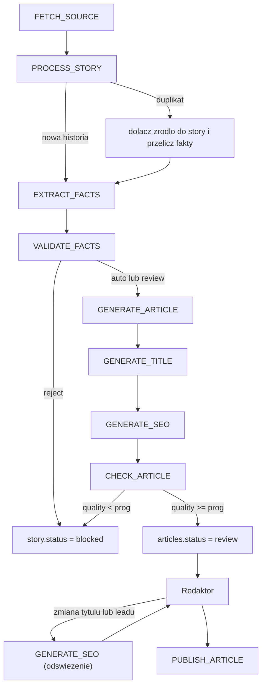

# Pipeline AI

Zasada nadrzędna: **LLM nie jest autorem, jest redaktorem pracującym na danych.** Model nigdy nie dostaje polecenia "napisz artykuł o transferze". Dostaje zatwierdzone fakty i pisze na ich podstawie tekst. To jedna decyzja, która najmocniej ogranicza halucynacje i jednocześnie daje audytowalność.

Kolejność, której nie zmieniamy:

```
zrodla -> fakty -> walidacja -> kontekst -> LLM -> draft -> czlowiek -> publikacja
```

---

## 1. Etapy i mapowanie na joby

| Etap                           | Job                | LLM               | Wejście                       | Wyjście                                |
| ------------------------------ | ------------------ | ----------------- | ----------------------------- | -------------------------------------- |
| 1. Pobranie                    | `FETCH_SOURCE`     | nie               | `sources`                     | `source_items`                         |
| 2. Deduplikacja i klastrowanie | `PROCESS_STORY`    | nie (MVP)         | `source_items`                | `stories`, `story_sources`             |
| 3. Ekstrakcja faktów           | `EXTRACT_FACTS`    | tak               | treści źródeł historii        | `facts`                                |
| 4. Ocena informacji            | `VALIDATE_FACTS`   | tak               | `facts` + `trust_score`       | `story_assessments`                    |
| 5. Treść                       | `GENERATE_ARTICLE` | tak               | zatwierdzone fakty + kontekst | `articles.content`                     |
| 6. Tytuł                       | `GENERATE_TITLE`   | tak (2 wywołania) | fakty + lead                  | `articles.title`                       |
| 7. SEO                         | `GENERATE_SEO`     | tak               | tytuł + lead                  | `seo_title`, `seo_description`, `slug` |
| 8. Kontrola jakości            | `CHECK_ARTICLE`    | tak               | artykuł + fakty               | `article_scores`                       |
| 9. Publikacja                  | `PUBLISH_ARTICLE`  | nie               | decyzja redaktora             | `status = published`, revalidate       |

Każdy etap to osobny job, osobna transakcja i osobny wpis w `llm_calls`. Etap 3 nie jest powtarzany, gdy etap 5 się wywróci - to realna oszczędność przy błędach API.



---

## 2. Etap 2: deduplikacja bez LLM

Wykrywanie, czy mamy już to wydarzenie, jest tanie i deterministyczne - nie ma powodu płacić za to modelem.

Kolejność sprawdzeń dla nowego `source_item`:

1. **Hash** - `sha256(url || title_normalized)` z ograniczeniem `UNIQUE`. Ten sam materiał pobrany dwa razy nie wchodzi do systemu.
2. **Podobieństwo tytułu** - `pg_trgm`, `similarity(title_normalized, ...) > 0.55`, w oknie 48 godzin.
3. **Zgodność encji** - rozpoznanie zawodników i klubów po `players.aliases` i `clubs.aliases`; wymagany co najmniej jeden wspólny podmiot.
4. **Zgodność typu wydarzenia** - `transfer` nie łączy się z `injury`.

Decyzja:

- warunki 2 - 4 spełnione: `source_item` dołącza do istniejącej historii, `stories.last_updated_at = now()`, kolejkowany `EXTRACT_FACTS` (fakty liczone ponownie dla pełnego zestawu źródeł),
- brak trafienia: nowa `story` ze statusem `new`.

Przykład, który ten mechanizm musi obsłużyć poprawnie - pięć różnych nagłówków to jedno wydarzenie:

```
Fabrizio Romano: "Manchester United rozpoczal rozmowy..."
BBC:              "Manchester United zainteresowany..."
Sky:              "United ruszyli po pomocnika..."
Goal:             "Red Devils negocjuja transfer..."
ESPN:             "Man United open talks..."
```

W V2 warstwa 2 zostaje zastąpiona embeddingami (`pgvector`, wyszukiwanie hybrydowe: wektor plus słowa kluczowe), co poprawia trafność przy parafrazach i tekstach w różnych językach.

---

## 3. Etap 3: ekstrakcja faktów

Plik promptu: `supabase/functions/_shared/prompts/01-extract-facts.md`.

System:

```
Jestes analitykiem informacji sportowych.

Twoim zadaniem jest wylacznie ekstrakcja faktow ze zrodel.

Nie wolno Ci:
- dopowiadac informacji,
- zgadywac,
- uzupelniac brakujacych danych,
- przedstawiac plotki jako faktu,
- laczyc informacji z wlasnej wiedzy o swiecie.

Kazdy fakt musi miec przypisane zrodlo (indeks zrodla z wejscia).
Jesli informacja nie wynika bezposrednio z tekstu zrodla, pomijasz ja.
Zwroc wylacznie JSON zgodny ze schematem.
```

Wejście - każde źródło z metadanymi zaufania, bo to zmienia interpretację tej samej informacji:

```json
{
  "sources": [
    {
      "index": 1,
      "source": "Manchester United",
      "source_type": "official_club",
      "trust_score": 1.0,
      "published_at": "2026-09-11T09:12:00Z",
      "title": "...",
      "content": "..."
    },
    {
      "index": 2,
      "source": "Fabrizio Romano",
      "source_type": "journalist",
      "trust_score": 0.95,
      "published_at": "2026-09-11T08:40:00Z",
      "title": "...",
      "content": "..."
    }
  ]
}
```

Dzięki temu model rozróżnia "oficjalne potwierdzenie transferu" od "ktoś napisał, że transfer może się wydarzyć".

Wyjście (structured output, walidowane zod):

```json
{
  "event_type": "transfer",
  "entities": [
    { "type": "player", "name": "Jan Kowalski" },
    { "type": "club", "name": "Manchester United" },
    { "type": "club", "name": "Lech Poznan" }
  ],
  "facts": [
    {
      "subject": "Manchester United",
      "predicate": "opened_talks_with",
      "object": "Jan Kowalski",
      "statement_pl": "Manchester United rozpoczal rozmowy o transferze Jana Kowalskiego.",
      "value": { "transfer_fee": null, "currency": null, "contract_until": "2028-06-30" },
      "confidence": 0.94,
      "source_indexes": [1, 2]
    }
  ],
  "unclear": ["Kwota transferu nie jest podana w zadnym ze zrodel."]
}
```

Reguły zapisu: fakty z `confidence < 0.60` są odrzucane na wejściu do bazy. Pole `unclear` jest zapisywane w `story_assessments.reasoning` i widoczne dla redaktora - brak informacji jest też informacją.

Implementacja (`_shared/handlers/extract-facts.ts`, logika w `_shared/lib/facts.ts`):

- jeden wiersz `facts` na parę (fakt, źródło), zgodnie z unikalnym indeksem; indeksy źródeł spoza wejścia są odrzucane,
- każde uruchomienie liczy fakty dla pełnego zestawu materiałów i zastępuje poprzednie; `unclear` jedzie do `VALIDATE_FACTS` w payloadzie,
- `PROCESS_STORY` kolejkuje `EXTRACT_FACTS` z kluczem `EXTRACT_FACTS:<story>:<source_item>`, bo unikalny `dedupe_key` obejmuje też joby `running` - klucz per historia gubiłby źródło dołączone w trakcie ekstrakcji,
- cache ekstrakcji: `VALIDATE_FACTS` dostaje klucz `VALIDATE_FACTS:<story>:<hash zestawu materiałów>`; istniejący job z tym kluczem oznacza, że ten zestaw był już policzony, i ekstrakcja kończy się bez wywołania modelu,
- historia z artykułem nie jest ekstrahowana ponownie - aktualizacja tekstu to `UPDATE_ARTICLE` (V2).

---

## 4. Etap 4: ocena informacji

Plik: `02-assess-facts.md`.

```
Jestes redaktorem sportowym.

Ocen informacje zawarte w FACTS.

Dla kazdego faktu okresl:
- confidence,
- czy jest potwierdzony przez wiecej niz jedno niezalezne zrodlo,
- czy istnieje sprzecznosc miedzy zrodlami,
- czy mozna go uzyc w artykule.

Uwzglednij trust_score zrodla. Zrodlo oficjalne przewaza nad agregatorem
i nad social media, nawet jesli tych drugich jest wiecej.
```

Wyjście:

```json
{
  "publishability": "review",
  "confidence": 0.87,
  "conflicts": [
    {
      "description": "Zrodlo 3 podaje kwote 12 mln EUR, zrodlo 4 podaje 9 mln EUR.",
      "source_indexes": [3, 4],
      "severity": "medium"
    }
  ],
  "approved_facts": ["fact-uuid-1", "fact-uuid-2"],
  "rejected_facts": [{ "id": "fact-uuid-3", "reason": "Wylacznie plotka z agregatora." }],
  "reasoning": "Rozpoczecie rozmow potwierdzone przez klub i dziennikarza. Kwota sprzeczna."
}
```

Progi decyzyjne (konfigurowalne w `settings`):

| Warunek                                                                  | Wynik                                    |
| ------------------------------------------------------------------------ | ---------------------------------------- |
| Brak faktów z `confidence >= 0.8` lub brak źródła o `trust_score >= 0.8` | `reject`, `story.status = blocked`       |
| Konflikt o `severity = high`                                             | `review` z wyróżnieniem w panelu         |
| `confidence >= 0.90`, brak konfliktów, co najmniej dwa niezależne źródła | `auto` (i tak trafia do redaktora w MVP) |

Dwa pierwsze progi to `settings.min_approved_fact_confidence` i `settings.min_source_trust` (domyślnie 0.8); `applyAssessmentRules` nakłada je w kodzie na wynik modelu.

Tylko fakty z `approved_facts` trafiają do etapu pisania. Reszta jest w bazie, ale nie w tekście.

Implementacja (`_shared/handlers/validate-facts.ts`):

- wiersze `facts` tego samego faktu z różnych źródeł są łączone (`groupFacts`); identyfikatorem faktu dla modelu jest wiersz z najbardziej wiarygodnego źródła,
- progi z tabeli wyżej nakłada kod (`applyAssessmentRules` w `contracts/assessment.ts`) na wynik modelu: identyfikatory spoza historii są usuwane, `reject` modelu zostaje `reject`, a `auto` bez spełnionych warunków spada do `review`. Progi są stałymi w kodzie; przeniesienie do `settings` wymaga migracji,
- historia bez faktów dostaje `reject` bez wywołania modelu,
- walidacja zestawu materiałów, który przestał być aktualny (doszło źródło po ekstrakcji), kończy się bez zmian - nowa ekstrakcja zakolejkuje własną walidację,
- `unclear` z ekstrakcji jest dopisywane do `reasoning`; po akceptacji historia przechodzi do `drafting`, a kolejka dostaje `GENERATE_ARTICLE`.

---

## 5. Etap 5: napisanie artykułu

Plik: `03-write-article.md`. Model nie widzi surowych tekstów źródeł - widzi wyłącznie zatwierdzone fakty i kontekst z bazy. To dodatkowo chroni przed przepisywaniem cudzych zdań.

```
Jestes dziennikarzem specjalizujacym sie w pilce noznej.

Napisz oryginalny artykul informacyjny na podstawie WYLACZNIE zatwierdzonych faktow.

ZASADY:
1. Nie wymyslaj faktow.
2. Nie dodawaj niepotwierdzonych szczegolow.
3. Jesli informacja pochodzi ze zrodla, zaznacz to odpowiednim sformulowaniem
   ("wedlug Fabrizio Romano", "jak podaje klub w komunikacie").
4. Nie kopiuj zdan ze zrodla.
5. Nie stosuj clickbaitu.
6. Nie uzywaj przesadnych okreslen ani sztucznego budowania napiecia.
7. Pisz naturalnym jezykiem polskim, w stronie czynnej.
8. Artykul ma dostarczac dodatkowego kontekstu (sytuacja klubu, historia zawodnika,
   stan negocjacji) - ten kontekst dostajesz w sekcji CONTEXT i tylko z niej korzystasz.
9. Nie powtarzaj tego samego faktu w kilku akapitach.
10. Dlugosc: 250 - 450 slow, 4 - 7 akapitow.
```

Kontekst podawany modelowi (z bazy, nie z pamięci modelu): profil zawodnika z `players`, dane klubów z `clubs` i `leagues`, poprzednie artykuły o tej historii, wcześniejsze transfery zawodnika z `transfers`.

Wyjście:

```json
{
  "lead": "...",
  "blocks": [
    { "type": "paragraph", "text": "..." },
    { "type": "quote", "text": "...", "attribution": "Fabrizio Romano" },
    { "type": "paragraph", "text": "..." }
  ],
  "used_fact_ids": ["uuid", "uuid"],
  "excerpt": "..."
}
```

`used_fact_ids` jest obowiązkowe - pozwala etapowi kontroli sprawdzić maszynowo, czy tekst nie wyszedł poza zatwierdzony zbiór faktów.

Implementacja (`_shared/handlers/generate-article.ts`):

- przed zapisem kod sprawdza `draftIssues` (`contracts/article.ts`): `used_fact_ids` i `fact_box` tylko z zatwierdzonych faktów, 4 - 7 akapitów, 250 - 450 słów w akapitach; naruszenie to błąd joba i ponowienie z backoffem,
- artykuł jest zapisywany jako `draft` (upsert po `story_id`) z tymczasowym tytułem z historii i slugiem `draft-<story>`; każda wersja modelu trafia do `article_revisions` z `edited_by = null`,
- artykuł, który wyszedł z `draft` (redaktor, publikacja), nie jest nadpisywany,
- job nieaktualny (zmienił się zestaw materiałów albo zatwierdzone fakty zniknęły po ponownej ekstrakcji) kończy się bez zapisu; klucze jobów od walidacji w dół mają postać `<TYP>:<story>:<hash zestawu materiałów>`,
- kontekst to zawodnicy i kluby rozpoznani w tytule historii i faktach (`lib/article-context.ts`), razem z klubem zawodnika i ligą klubu.

---

## 6. Etap 6: tytuł jako osobne zadanie

Tytuł decyduje o Discover i jest najbardziej narażony na clickbait, dlatego ma własny etap i własne kryteria.

Wywołanie A (`04-generate-titles.md`) - 5 propozycji:

```json
{ "titles": ["...", "...", "...", "...", "..."] }
```

Wywołanie B (`05-select-title.md`) - wybór:

```
Wybierz najlepszy tytul.

Priorytety, w tej kolejnosci:
1. dokladnosc,
2. jasnosc,
3. atrakcyjnosc,
4. Discover,
5. SEO.

Zakaz:
- clickbaitu,
- wykrzyknikow,
- sztucznego budowania napiecia,
- ukrywania kluczowej informacji ("to sie wydarzylo", "nie uwierzysz"),
- pytan retorycznych,
- wielkich liter w calym wyrazie.

Maksymalnie 70 znakow. Tytul musi zawierac nazwe zawodnika lub klubu.
```

```json
{
  "selected": "Manchester United rozpoczal rozmowy o transferze Kowalskiego",
  "reason": "Zawiera podmiot, czynnosc i stan negocjacji, bez przesady.",
  "rejected_reasons": { "2": "Ukrywa kluczowa informacje.", "4": "Przesadne okreslenie." }
}
```

Walidacja deterministyczna po stronie kodu, przed zapisem: długość, brak `!`, brak `?` na końcu, brak wyrazów z listy zakazanej (`szok`, `hit`, `bomba`, `nie uwierzysz`, `to koniec`), obecność rozpoznanej encji.

SEO (`07-generate-seo.md`) to osobne wywołanie po wyborze tytułu: z tytułu i leadu powstają `seo_title` (do 70 znaków), `seo_description` (120 - 165 znaków) i `slug`. Numer pliku jest dalszy niż QA, bo prompt doszedł po ustaleniu numeracji; kolejność jobów wyznacza tabela z sekcji 1, nie numer pliku.

Implementacja (`generate-title.ts`, `generate-seo.ts`):

- do wywołania B trafiają wyłącznie kandydaci, którzy przeszli `checkTitle` z encjami rozpoznanymi w faktach; wybór spoza tej listy albo niespełniający kontroli to błąd joba, tak samo jak brak jakiegokolwiek poprawnego kandydata,
- gdy słownik zawodników i klubów nie rozpoznaje żadnej encji, wymóg encji w tytule nie jest sprawdzany - pozostałe reguły tak,
- `seo_title` przechodzi `checkTitle`; zajęty slug dostaje sufiks `-2`, `-3` w granicy 90 znaków (`lib/slug.ts`),
- oba etapy zapisują tylko artykuł w `draft`; wyjątkiem jest odświeżenie SEO opisane niżej.

Odświeżenie SEO po edycji redaktora (migracja 0025). Gdy redaktor zmieni w recenzji tytuł albo lead, `save_article_edit` w tej samej transakcji czyści `seo_title` i `seo_description` i kolejkuje `GENERATE_SEO` z kluczem `GENERATE_SEO:refresh:<article_id>` (przez `enqueue_seo_refresh`, bo redaktor nie ma zapisu do `jobs`). Zmiana samej treści niczego nie kolejkuje, a kilka edycji przed przetworzeniem joba daje jeden job. Job w toku jest przy kolejnej edycji odpinany od klucza, żeby odświeżenie nowej wersji nie zginęło na konflikcie `dedupe_key`. Handler rozpoznaje tryb po stanie artykułu (`seoJobMode` w `lib/seo-mode.ts`) i kluczu joba:

- `draft` - ścieżka opisana wyżej, ze slugiem i kolejką do `CHECK_ARTICLE`,
- `review` lub `approved` z pustym SEO i job z kluczem odświeżenia - ten sam prompt 07 i ta sama wersja, wejście z aktualnego tytułu i leadu, walidacja zod i `checkTitle` jak w szkicu. Zapisuje tylko `seo_title` i `seo_description`, bez zmiany sluga (slug zmienia się tylko w szkicu) i bez ponownej kontroli jakości. Zapis jest warunkowy: status, puste SEO oraz tytuł i lead równe tym, z których powstało SEO. Gdy redaktor zmienił tekst w trakcie wywołania modelu, zapis nie przechodzi i job kończy się błędem; nową wersję odświeża job zakolejkowany przy tej edycji, a ponowienie starego (już bez klucza) kończy się bez pracy,
- w pozostałych przypadkach (opublikowany, SEO już uzupełnione, job bez klucza odświeżenia) zapisuje log i kończy.

Do czasu odświeżenia puste pola SEO blokują „Publikuj” (`publishBlockers`), a panel pokazuje komunikat o odświeżaniu metadanych.

---

## 7. Etap 8: automatyczna kontrola jakości

Plik: `06-qa-check.md`. Model dostaje gotowy artykuł oraz listę zatwierdzonych faktów i ocenia go jako recenzent.

```json
{
  "factual_accuracy": 0.96,
  "originality": 0.89,
  "seo": 0.91,
  "clickbait": 0.02,
  "unsupported_claims": 0,
  "quality": 0.93,
  "issues": [{ "severity": "low", "block": 3, "message": "Powtorzenie informacji z akapitu 1." }]
}
```

Decyzja po scoringu:

| Warunek                                                            | Akcja                                                                       |
| ------------------------------------------------------------------ | --------------------------------------------------------------------------- |
| `quality >= 0.90` i `unsupported_claims = 0` i `clickbait <= 0.10` | `articles.status = 'review'`, oznaczenie szybkiej ścieżki w panelu          |
| `quality` w przedziale 0.70 - 0.90                                 | `review` ze wskazaniem uwag                                                 |
| `quality < 0.70` lub `unsupported_claims > 0`                      | `status = 'draft'`, `story.status = 'blocked'`, nie zajmuje czasu redaktora |

W MVP **żaden wynik nie prowadzi do automatycznej publikacji**. `settings.auto_publish_enabled` pozostaje `false`; dopiero po kilku miesiącach danych o poprawkach redaktora rozważamy automatyzację wybranych kategorii.

Do scoringu dochodzą sprawdzenia deterministyczne, tańsze i pewniejsze od modelu: czy każdy fakt z tekstu jest w `used_fact_ids`, czy nie ma zdania skopiowanego ze źródła (n-gramy, 8 słów), czy długość i liczba akapitów mieszczą się w zakresie, czy tytuł przechodzi listę zakazaną.

Implementacja (`_shared/handlers/check-article.ts`, kontrole w `lib/article-checks.ts`):

- `used_fact_ids` sprawdza `GENERATE_ARTICLE` przed zapisem (nie jest przechowywane w artykule); kontrola jakości sprawdza zapisane bloki: `fact_box` tylko z zatwierdzonych faktów, 4 - 7 akapitów, 250 - 450 słów,
- kopiowanie: wspólne 8-gramy tekstu (lead, akapity, nagłówki, listy) z tytułami i treściami materiałów historii po normalizacji; cytat z atrybucją jest wyjątkiem,
- każde trafienie kontroli deterministycznej trafia do `article_scores.issues` jako `high` z prefiksem `[kontrola]` i blokuje artykuł niezależnie od ocen modelu,
- `review`: `articles.status = 'review'` i `stories.status = 'review'`; `blocked`: artykuł zostaje w `draft`, historia dostaje `blocked`,
- `settings.max_articles_per_hour`: po osiągnięciu limitu job wraca z backoffem, zanim zapłaci za model; liczone są oceny z ostatniej godziny dla artykułów w `review` lub dalej,
- ponowna ocena artykułu, który ma już `article_scores`, idzie na model eskalacyjny.

---

## 8. Routing modeli

```
NORMALNY NEWS            -> GPT-5.6 Luna
TRUDNY / SPRZECZNE ZRODLA -> GPT-5.6 Sol
WERYFIKACJA              -> GPT-5.6 Luna
```

| Etap               | Model domyślny | Eskalacja                                                                        |
| ------------------ | -------------- | -------------------------------------------------------------------------------- |
| `EXTRACT_FACTS`    | Luna           | Sol, gdy powyżej 4 źródeł lub źródła w różnych językach                          |
| `VALIDATE_FACTS`   | Luna           | Sol, gdy wykryto konflikt lub `confidence < 0.80`                                |
| `GENERATE_ARTICLE` | Luna           | Sol, gdy `publishability = 'review'` z powodu konfliktów albo `importance >= 80` |
| `GENERATE_TITLE`   | Luna           | brak                                                                             |
| `GENERATE_SEO`     | Luna           | brak                                                                             |
| `CHECK_ARTICLE`    | Luna           | Sol przy ocenie ponownej po odrzuceniu                                           |

Nie ma sensu przepalać najdroższego modelu na każdy artykuł. Nazwy modeli są konfiguracją (`settings.model_default`, `settings.model_escalation`), nie stałymi w kodzie, więc zmiana modelu nie wymaga deployu.

Kontrola kosztów:

- `llm_calls` zapisuje tokeny i koszt każdego wywołania; koszt liczony z cennika w `settings.model_prices` (`{"<model>": {"input_per_mtok": ..., "output_per_mtok": ...}}`, USD za milion tokenów) - model bez cennika zapisuje `cost_usd = null`,
- `settings.daily_llm_budget_usd` - po przekroczeniu dispatcher przestaje kolejkować joby LLM i podnosi alert,
- limit tokenów wejściowych per etap; treści źródeł są skracane do fragmentów istotnych dla wydarzenia,
- cache wyników ekstrakcji po zestawie `source_items` - powtórne uruchomienie tego samego joba nie płaci drugi raz.

---

## 9. Aktualizacja artykułu zamiast nowego tekstu

Historia żyje w czasie:

```
09:00  Manchester United zainteresowany Kowalskim
11:00  Manchester United rozpoczal rozmowy
14:00  Klub zlozyl pierwsza oferte
```

Zamiast trzech niemal identycznych artykułów powstaje jeden z timeline'em w `article_updates`. Nowe źródło dla istniejącej historii uruchamia `EXTRACT_FACTS`, a jeśli pojawi się nowy fakt istotny (nowy `predicate` albo zmiana `transfer_status`), kolejkowany jest `UPDATE_ARTICLE`, który generuje krótki blok aktualizacji zamiast całego tekstu.

To jednocześnie:

- lepsze dla czytelnika, który widzi rozwój sprawy w jednym miejscu,
- lepsze dla Google, bo `dateModified` rośnie na stronie, która już ma sygnały,
- bezpieczniejsze wobec "scaled content abuse", bo nie produkujemy serii podobnych tekstów.

`UPDATE_ARTICLE` wchodzi w V2; w MVP nowy istotny fakt oznacza historię w panelu jako wymagającą uwagi redaktora.

---

## 10. Obsługa błędów i jakość wykonania

- **Nieprawidłowy JSON z modelu**: jedna ponowna próba z komunikatem błędu walidacji dołączonym do promptu, potem `fail_job`.
- **Błąd API lub limit**: `fail_job` z backoffem `30s * 2^attempts`, maksymalnie 3 próby, potem `dead` i alert w dashboardzie.
- **Model zwrócił pustą listę faktów**: historia dostaje `blocked` z powodem, bez generowania tekstu.
- **Osierocone joby**: `requeue_stale_jobs()` przywraca zadania w `running` dłużej niż 15 minut.
- **Idempotencja**: handlery używają `upsert` po `story_id` lub `article_id`, więc powtórzenie joba nie tworzy duplikatu treści.

---

## 11. Testowalność i praca bez kosztów

`LLM_ENABLED=false` przełącza klient LLM na fixtures z `_shared/llm/fixtures/`. Cały pipeline - od RSS, przez deduplikację, po artykuł w statusie `review` - da się przejść lokalnie bez klucza OpenAI. Dzięki temu:

- testy w CI nie wołają zewnętrznego API,
- zmiany w handlerach i schemacie sprawdzamy natychmiast,
- deterministyczne części (dedup, hashe, walidacja tytułu, backoff) są pokryte testami jednostkowymi w `vitest`.

Prompty są plikami `.md`; każdy zapis artykułu zapamiętuje `prompt_version` (hash treści promptu) i `model_used`. Po zmianie promptu można porównać jakość wersji na tych samych historiach.

Rejestr `PROMPT_VERSIONS` w `_shared/prompts/versions.ts` trzyma numer wersji i hash każdego promptu. Test `tests/llm/prompts.test.ts` porównuje hash z treścią pliku i sprawdza, że każda fixture spełnia schemat zod swojego etapu - zmiana promptu bez podbicia wersji albo fixture niezgodna z kontraktem nie przejdzie CI. Fixtures w `_shared/llm/fixtures/` opisują jedną historię (przedłużenie kontraktu Bruno Fernandesa); UUID faktów wstawia handler przez placeholdery `{{fact_1}}`, `{{fact_2}}` itd., w kolejności zapisu faktów.

---

## 12. Metryki jakości pipeline'u

Zbierane od pierwszego dnia, bo bez nich nie da się odpowiedzialnie zwiększać automatyzacji:

- odsetek artykułów zaakceptowanych bez edycji,
- średnia liczba znaków zmienionych przez redaktora (z `article_revisions`),
- liczba wykrytych halucynacji (odrzucenia z powodem `factual`),
- skuteczność deduplikacji: liczba historii, które redaktor ręcznie scalił lub rozdzielił,
- średni koszt i czas wytworzenia artykułu (`llm_calls`),
- czas od publikacji źródła do publikacji artykułu,
- wyświetlenia i CTR w Discover oraz Search Console per kategoria.
