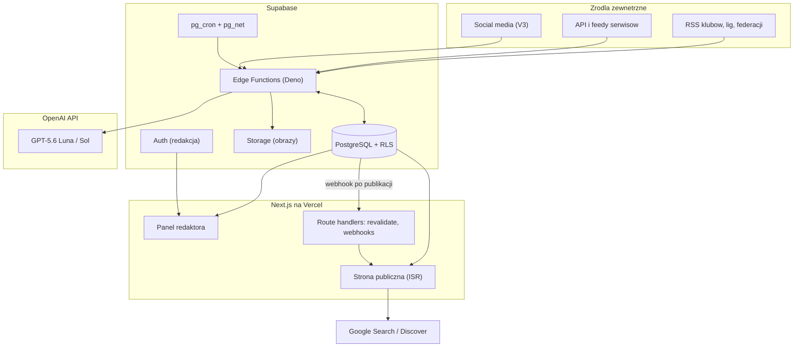
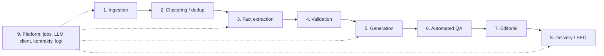
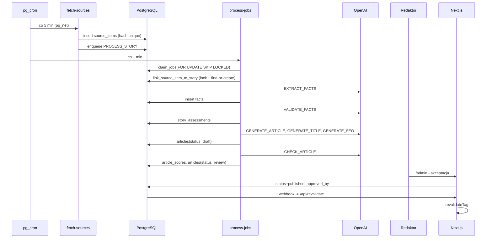
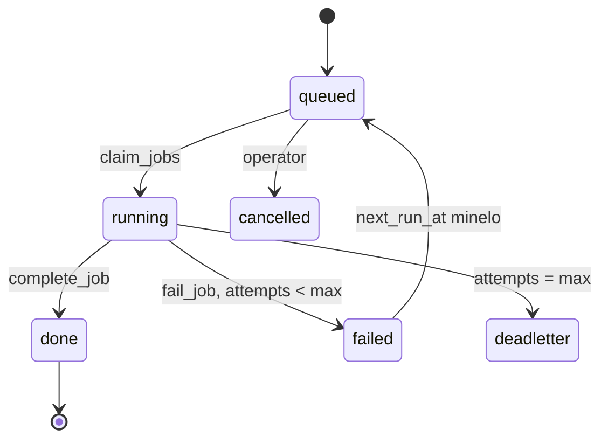

# Architektura systemu

Portal z newsami piłkarskimi budowany jako **mały newsroom oparty o AI**, a nie generator artykułów. System pobiera informacje ze źródeł, grupuje je w wydarzenia, wyciąga z nich strukturalne fakty, weryfikuje je, dopiero potem generuje polski tekst i przekazuje go redaktorowi do akceptacji.

Dokumenty powiązane:

- [docs/database.md](database.md) - schemat bazy danych
- [docs/ai-pipeline.md](ai-pipeline.md) - prompty, kontrakty JSON, routing modeli
- [docs/roadmap.md](roadmap.md) - zakres MVP i kolejne etapy
- [AGENTS.md](../AGENTS.md) - konwencje pracy w repozytorium

---

## 1. Założenia i ograniczenia projektowe

| Założenie                                             | Konsekwencja architektoniczna                                                                                                              |
| ----------------------------------------------------- | ------------------------------------------------------------------------------------------------------------------------------------------ |
| LLM jest redaktorem pracującym na danych, nie autorem | Rozdzielone etapy: fakty -> walidacja -> tekst. Model nigdy nie dostaje polecenia "napisz artykuł o X" bez zatwierdzonych faktów           |
| Człowiek w pętli jest obowiązkowy w MVP               | `articles` nie może przejść do `published` bez `approved_by` (wymuszone triggerem w bazie)                                                 |
| Unikamy ryzyka "scaled content abuse"                 | Jedna historia = jeden artykuł aktualizowany w czasie, a nie kolejne podobne teksty. Każdy artykuł agreguje wiele źródeł i dodaje kontekst |
| Koszt LLM musi być przewidywalny                      | Domyślnie tani model, eskalacja tylko przy konfliktach; budżet tokenów i limit artykułów na godzinę w tabeli `settings`                    |
| MVP ma być proste                                     | Brak osobnej infrastruktury kolejkowej, brak mikroserwisów, brak embeddingów. Kolejka to tabela w Postgresie                               |
| System ma być skalowalny                              | Praca podzielona na małe, idempotentne joby; workery bezstanowe i uruchamiane równolegle                                                   |

---

## 2. Widok ogólny



Podział odpowiedzialności między runtime'ami jest sztywny:

- **Edge Functions (Deno)** - cała praca w tle: pobieranie źródeł, deduplikacja, wywołania LLM, scoring, publikacja. Tylko tu używany jest klucz `service_role` i klucz OpenAI.
- **Next.js** - warstwa prezentacji i panel redaktora. Czyta z bazy przez RLS, zapisuje wyłącznie akcje redakcyjne (akceptacja, edycja, odrzucenie). Nigdy nie wywołuje LLM i nigdy nie przetwarza źródeł.
- **PostgreSQL** - jedyne źródło prawdy o stanie systemu, w tym stan kolejki jobów.

---

## 3. Moduły

System dzieli się na dziewięć modułów. Granice modułów są widoczne w strukturze katalogów i w typach jobów.



### 3.1 Ingestion

Pobiera i normalizuje treści ze źródeł. W MVP tylko RSS i feedy JSON - bez scrapowania HTML.

- Wejście: wiersz w `sources` z `rss_url`, `etag`, `last_checked_at`.
- Wyjście: wiersze w `source_items` z `hash` (sha256 z URL i znormalizowanego tytułu), `raw_data` z pełną odpowiedzią.
- Odporność: `If-None-Match` / `If-Modified-Since`, timeout 10 s, maksymalnie 3 próby, licznik `consecutive_failures` i automatyczne wyłączanie źródła po 10 błędach (circuit breaker).
- Zasada: nigdy nie przechowujemy pełnego tekstu cudzego artykułu dłużej niż potrzeba do ekstrakcji faktów; `source_items.content` jest materiałem roboczym, nie treścią publikowaną.

### 3.2 Clustering / deduplikacja

Odpowiada na pytanie "czy to nowe wydarzenie, czy już je mamy".

MVP - trzy warstwy, w tej kolejności:

1. `hash` w `source_items` z ograniczeniem `UNIQUE` - odrzuca ten sam URL i tytuł.
2. Podobieństwo tytułu przez `pg_trgm` (`similarity > 0.55`) w oknie 48 godzin.
3. Zgodność encji - co najmniej jeden wspólny zawodnik lub klub rozpoznany słownikiem z `players` i `clubs`.

Jeśli trafienie: nowy `source_item` dołącza do istniejącej `story` przez `story_sources`, a historia dostaje `last_updated_at = now()`. Jeśli brak trafienia: powstaje nowa `story` ze statusem `new`.

Find-or-create jest funkcją SQL `link_source_item_to_story`: `pg_advisory_xact_lock`, ponowne szukanie trigramem i encjami, potem insert. Klient supabase-js nie trzyma transakcji między requestami, więc lock w osobnym RPC nic nie daje - dwa równoległe `PROCESS_STORY` mogłyby wtedy utworzyć dwie historie o tym samym wydarzeniu. `EXTRACT_FACTS` wchodzi w etapie 2.

V2 zastępuje warstwę 2 embeddingami w `pgvector` (podejście hybrydowe: wektor plus keyword).

### 3.3 Fact extraction

Zamienia tekst źródeł na strukturalne fakty (`facts`) w formacie subject-predicate-object z `confidence` i przypisanym `source_id`. Model ma zakaz uzupełniania brakujących danych. Szczegóły promptu i schematu w [docs/ai-pipeline.md](ai-pipeline.md).

### 3.4 Validation

Ocenia zestaw faktów historii: `confidence`, konflikty między źródłami, `publishability` (`auto` / `review` / `reject`). Uwzględnia `trust_score` źródła, więc oficjalne potwierdzenie klubu waży inaczej niż wpis agregatora. Wynik zapisuje do `story_assessments`.

### 3.5 Generation

Trzy osobne zadania, świadomie nie łączone w jedno wywołanie:

1. `GENERATE_ARTICLE` - treść na podstawie wyłącznie zatwierdzonych faktów, zapisywana jako bloki JSON.
2. `GENERATE_TITLE` - najpierw 5 propozycji, potem wybór najlepszej według priorytetów: dokładność, jasność, atrakcyjność, Discover, SEO.
3. `GENERATE_SEO` - meta title, meta description, slug, `og:*`.

### 3.6 Automated QA

Przed pokazaniem redaktorowi artykuł przechodzi automatyczną ocenę: zgodność z faktami, oryginalność, SEO, poziom clickbaitu, liczba twierdzeń bez podparcia w `facts`. Wynik w `article_scores`. Artykuł nigdy nie omija redaktora w MVP - scoring służy do sortowania kolejki i oznaczania szybkiej ścieżki.

### 3.7 Editorial

Panel `/admin`: dashboard z licznikami, kolejka do weryfikacji sortowana po `importance` i `confidence`, widok artykułu ze źródłami, faktami i scoringiem oraz akcjami Odrzuć / Edytuj / Publikuj. Każda akcja trafia do `audit_log`, każda edycja treści do `article_revisions` - to później pozwala policzyć, jak często redaktor musi poprawiać AI.

Dashboard (`app/admin/page.tsx`, dane w `lib/admin/dashboard-data.ts`) czyta wyłącznie na sesji redaktora, przez RLS:

- liczniki: nowe historie (`stories.first_seen_at` z ostatnich 24 h), do weryfikacji (`articles.status = 'review'`), gotowe do publikacji (`approved`), opublikowane dziś (`published_at` od północy w `Europe/Warsaw`),
- kolejka do weryfikacji: artykuły `review` posortowane po `stories.importance`, potem `story_assessments.confidence`, a przy remisie wyżej ten, który dłużej czeka. Po wadze sortuje już baza, przed limitem 200 pozycji; po pewności z zagnieżdżonej oceny PostgREST sortować nie umie, więc robi to kod. Gdy kolejka jest dłuższa niż limit, panel pokazuje „Pokazano X z Y”,
- sekcja „Pilne”: historie z `importance >= 80` w statusach od `new` do `approved`, aktualizowane w ciągu doby. Próg to `HIGH_IMPORTANCE` z `_shared/lib/taxonomy.ts` (ten sam eskaluje model), a nie wpis w `settings`, bo `settings` jest widoczne tylko dla admina.

Widok recenzji (`app/admin/artykuly/[id]/page.tsx`, dane w `lib/admin/review-data.ts`, logika w `lib/admin/review.ts`) czyta na sesji redaktora:

- treść renderuje `components/article/BlockRenderer.tsx` po walidacji `articleContentSchema`; treść spoza schematu daje ostrzeżenie z listą błędów zamiast strony błędu, a uwagi `article_scores.issues` z polem `block` są pokazywane pod właściwym blokiem,
- `unsupported_claims > 0` daje baner „Publikacja zablokowana” - ten sam warunek, co w `enforce_publish_guard`,
- fakty są łączone przez `groupFacts`, tak jak widziała je walidacja; fakt jest zatwierdzony, gdy którykolwiek wiersz grupy jest w `approved_fact_ids`. Brak oceny albo ocena wskazująca fakty sprzed ponownej ekstrakcji (ten sam warunek, co w `loadApprovedFacts`) daje „bez oceny”, nie „odrzucony”,
- `story_assessments.conflicts` zapisuje numery materiałów (`source_indexes`) z wejścia `VALIDATE_FACTS`. Panel odtwarza tę numerację przez `buildExtractionInput`, więc pokazuje nazwy źródeł. Gdy któryś `story_sources.created_at` jest późniejszy niż `story_assessments.updated_at`, numeracja mogła się przesunąć: panel pokazuje wtedy same numery z ostrzeżeniem. Zmiany `trust_score` źródła po ocenie ten warunek nie wykrywa - dokładne rozwiązanie to zapis id źródeł w konfliktach przez `VALIDATE_FACTS`,
- limity pól SEO pochodzą z `seoOutputSchema`; wartość spoza zakresu jest wyróżniona,
- linki do materiałów źródłowych tylko dla adresów `http(s)`.

Edycja tytułu i leadu (`components/admin/ArticleMetaForm.tsx`, server action `saveArticleMeta` w `app/admin/artykuly/[id]/actions.ts`) jest dostępna tylko dla artykułów `review`:

- przed zapisem idą te same kontrole deterministyczne, co w `CHECK_ARTICLE` (`articleCheckIssues`), na tych samych danych: zatwierdzone fakty z `loadApprovedFacts`, teksty materiałów i encje z `loadArticleContext`. Loadery pipeline'u działają tu na sesji redaktora, więc obowiązuje RLS. Każde trafienie blokuje zapis,
- zapis idzie przez `save_article_edit` z `updated_at`, które redaktor widział. Funkcja w jednej transakcji zapisuje rewizję i artykuł, a kody błędów zamienia na komunikaty `lib/admin/article-edit.ts`,
- gdy ostatnia rewizja redaktora jest późniejsza niż `article_scores.checked_at`, sekcja „Ocena AI” pokazuje, że ocena dotyczy wersji sprzed edycji. Ponowna ocena po edycji to osobna zmiana pipeline'u.

Widok jobów (`app/admin/joby/page.tsx`, dane w `lib/admin/ops-data.ts`, logika w `lib/admin/ops.ts`) jest tylko dla admina, zgodnie z polityką `jobs_admin_select`:

- lista jobów `dead` i `failed` (martwe pierwsze, limit 100) z typem, liczbą prób, początkiem błędu i linkiem do artykułu albo listy historii. `jobs` nie ma `updated_at`, więc martwy job pokazuje `processed_at` ustawiane przez `fail_job`, a `failed` termin kolejnej próby (`next_run_at`),
- „Ponów” to server action: `requireRole('admin')`, walidacja id zodem, RPC `requeue_dead_job` na sesji admina (bez `service_role`), potem `revalidatePath('/admin/joby')`. Rolę sprawdza też sama funkcja w bazie.

Dashboard pokazuje adminowi alert z liczbą martwych jobów i linkiem do `/admin/joby`.

Widok zdrowia źródeł (`app/admin/zrodla/page.tsx`, te same pliki `lib/admin/ops*`) czyta każdy redaktor (`sources_editor_select`):

- stan wyliczany z `active` i `consecutive_failures` wobec `SOURCE_FAILURE_LIMIT` z `_shared/lib/circuit-breaker.ts` (ten sam próg co w `fetch-source`); źródła z problemami na górze,
- ostatni błąd pobierania (najnowszy `jobs.error` dla `FETCH_SOURCE` danego źródła) tylko dla admina, bo `jobs` jest w RLS tylko dla admina,
- przełącznik `active` tylko dla admina: server action z `requireRole('admin')` i zodem, `update sources` na sesji (`sources_admin_write`) z warunkiem na poprzedni stan, więc nieaktualny formularz nic nie zmienia. Włączenie zeruje w tym samym zapisie `consecutive_failures`, a trigger `sources_audit_change` zapisuje jedną zmianę `source_change`.

### 3.8 Delivery / SEO

Renderowanie strony publicznej z ISR, generowanie sitemap, JSON-LD, feedów RSS i unieważnianie cache po publikacji. Wymagania szczegółowe w sekcji 8.

- Artykuł ma adres `/<slug kategorii>/<slug>` (jedna trasa `app/(site)/[category]/[slug]`); artykuł bez kategorii trafia pod `pilka-nozna`, a zła kategoria w adresie daje 308 na adres kanoniczny.
- Dane publiczne czyta `lib/public/queries.ts` klientem anon bez ciasteczek (sesja redaktora nie wpuści szkicu do cache), z filtrem `status = 'published'` ponad RLS. Zapytania idą do Data Cache Next.js z tagami z `lib/public/cache-tags.ts` i `revalidate = 60` jako siatką bezpieczeństwa do czasu webhooka publikacji. `cacheComponents` jest wyłączone: włączenie dotyczy całej aplikacji, łącznie z panelem.
- Aktualizacje (`article_updates`) bez `approved_by` nie trafiają na stronę.

### 3.9 Platform

Warstwa wspólna: kolejka jobów, klient LLM z retry i logowaniem kosztów, kontrakty zod, logger, konfiguracja runtime w `settings`.

---

## 4. Struktura katalogów

Jedno repozytorium, jedna aplikacja Next.js w katalogu głównym, cały backend w `supabase/`.

```
/
├─ AGENTS.md
├─ .env.example
├─ docs/
│  ├─ architecture.md
│  ├─ database.md
│  ├─ ai-pipeline.md
│  ├─ roadmap.md
│  ├─ editorial-policy.md          # zasady redakcyjne, publikowane też na stronie
│  └─ adr/                         # decyzje architektoniczne
├─ app/
│  ├─ (site)/
│  │  ├─ page.tsx                  # strona główna
│  │  ├─ transfery/page.tsx
│  │  ├─ transfery/[slug]/page.tsx
│  │  ├─ pilka-nozna/[slug]/page.tsx
│  │  ├─ zawodnicy/[slug]/page.tsx
│  │  ├─ kluby/[slug]/page.tsx
│  │  ├─ autorzy/[slug]/page.tsx
│  │  └─ o-nas/zasady-redakcyjne/page.tsx
│  ├─ login/                       # logowanie i wylogowanie (server actions)
│  ├─ brak-dostepu/page.tsx        # zalogowany bez roli redaktora
│  ├─ admin/
│  │  ├─ layout.tsx                # requireRole('editor'), nawigacja
│  │  ├─ page.tsx                  # dashboard newsroomu
│  │  ├─ historie/[id]/page.tsx    # historia + fakty + źródła
│  │  ├─ artykuly/[id]/page.tsx    # widok review
│  │  └─ zrodla/page.tsx           # zarządzanie źródłami
│  ├─ api/
│  │  ├─ revalidate/route.ts       # webhook z Supabase po publikacji
│  │  └─ feed/route.ts             # RSS portalu
│  ├─ sitemap.ts
│  ├─ sitemap-news/route.ts
│  └─ robots.ts
├─ components/
│  ├─ ui/                          # shadcn/ui
│  ├─ article/                     # BlockRenderer, UpdateTimeline, SourceList, JsonLd
│  └─ admin/                       # ScoreBadge, FactTable, ReviewActions
├─ lib/
│  ├─ supabase/{server,client,admin,proxy}.ts
│  ├─ auth/                        # dal.ts (requireRole), roles.ts, redirects.ts
│  ├─ seo/{metadata,jsonld,slug}.ts
│  └─ format/{date,number}.ts
├─ supabase/
│  ├─ config.toml
│  ├─ seed.sql
│  ├─ migrations/                  # 0001_... .sql, niezmienialne po scaleniu
│  └─ functions/
│     ├─ deno.json                 # import map: zod, supabase-js, openai
│     ├─ _shared/
│     │  ├─ contracts/             # zod + database.types.ts (wspólne z Next.js)
│     │  ├─ prompts/               # 01-extract-facts.md ... 07-generate-seo.md, versions.ts
│     │  ├─ llm/                   # models.ts, call.ts, fixtures/
│     │  ├─ handlers/              # jeden plik na typ joba
│     │  └─ lib/                   # jobs.ts, rss.ts, dedupe.ts, hash.ts, log.ts
│     ├─ cron-dispatch/            # wyzwalane przez pg_cron
│     ├─ fetch-sources/
│     └─ process-jobs/             # worker kolejki
└─ tests/                          # vitest: parsery, hashe, backoff, kontrakty
```

Dwie decyzje warte podkreślenia:

- **Kontrakty leżą w `supabase/functions/_shared/contracts/`** i są współdzielone z Next.js przez alias w `tsconfig.json`. Deno rozwiązuje `import { z } from "zod"` przez import map, Next.js przez `node_modules`. Jedno źródło prawdy dla typów bazy i schematów LLM, bez duplikacji i bez problemów z bundlowaniem plików spoza katalogu funkcji.
- **Prompty to wersjonowane pliki `.md`**, a nie stringi w kodzie. `articles.prompt_version` zapisuje hash użytego promptu, co pozwala audytować jakość po kilku miesiącach i porównywać wersje.

---

## 5. Przepływ danych



Kluczowa cecha: każdy etap kończy się **zapisem do bazy i zakolejkowaniem następnego joba**. Nie istnieje długi łańcuch wywołań w jednej funkcji, więc błąd jednego etapu nie niszczy całego pipeline'u ani nie wymusza powtórzenia kosztownych wywołań LLM.

---

## 6. System jobów

Kolejka to tabela `jobs` w Postgresie - w MVP to wystarcza i eliminuje osobną infrastrukturę.



Właściwości:

- **Atomowe pobieranie zadań**: `claim_jobs(p_types, p_limit)` używa `FOR UPDATE SKIP LOCKED`, więc wiele równoległych instancji `process-jobs` nigdy nie weźmie tego samego joba.
- **Idempotencja**: `jobs.dedupe_key` z ograniczeniem `UNIQUE` dla stanów aktywnych - powtórne zakolejkowanie tego samego zadania nie tworzy duplikatu. Handlery są napisane tak, że powtórzenie joba nie tworzy drugiego artykułu (upsert po `story_id`).
- **Backoff**: `next_run_at = now() + interval '30 seconds' * 2^attempts`, `max_attempts` domyślnie 3, potem status `dead` i alert w dashboardzie.
- **Priorytety**: `priority` (0-100) - oficjalne potwierdzenia i historie o wysokim `importance` idą przed rutynowymi newsami.
- **Widoczność**: każde wywołanie LLM zapisuje się w `llm_calls` z modelem, tokenami, kosztem i czasem, więc koszt da się rozliczyć per historia i per typ joba.

Skalowanie: zwiększenie przepustowości polega na wywołaniu `process-jobs` częściej lub w większej liczbie równoległych instancji. Baza pozostaje jedynym punktem synchronizacji. Gdy to przestanie wystarczać (rząd wielkości tysiące jobów na minutę), naturalnym krokiem jest przeniesienie kolejki na dedykowaną usługę bez zmiany handlerów - dlatego dostęp do kolejki jest schowany za `_shared/lib/jobs.ts`.

---

## 7. Publikacja i unieważnianie cache

1. Redaktor akceptuje artykuł w `/admin`. Server action ustawia `status = 'published'`, `published_at`, `approved_by`.
2. Trigger w bazie blokuje publikację bez `approved_by` i wpisuje zdarzenie do `audit_log`.
3. Database Webhook Supabase wysyła zdarzenie na `POST /api/revalidate` z nagłówkiem `x-webhook-secret`.
4. Route handler weryfikuje sekret i woła `revalidateTag` dla `articles`, `article:<slug>`, `category:<slug>` oraz `sitemap`.
5. Strona artykułu renderuje się statycznie (ISR) i jest serwowana z CDN.

Aktualizacja istniejącej historii nie tworzy nowego artykułu. Dopisuje wpis do `article_updates`, podnosi `updated_at`, unieważnia te same tagi. Na stronie pojawia się blok "Aktualizacja" z godziną - to jest realna dodatkowa wartość dla użytkownika i jednocześnie sygnał świeżości dla Discover.

Strategia renderowania:

| Trasa                                | Strategia                                      |
| ------------------------------------ | ---------------------------------------------- |
| `/` i strony kategorii               | ISR, `revalidate = 60` plus tagi               |
| `/transfery/[slug]`                  | ISR generowane na żądanie, unieważniane tagiem |
| `/zawodnicy/[slug]`, `/kluby/[slug]` | ISR, `revalidate = 3600`                       |
| `/admin/**`                          | Dynamiczne, `no-store`, wymuszony login        |
| `sitemap.ts`, `feed`                 | ISR, unieważniane tagiem `sitemap`             |

---

## 8. Wymagania SEO i Discover

### 8.1 Na poziomie artykułu

- `title` do 70 znaków, `meta description` 140-160 znaków, oba generowane osobnym zadaniem i weryfikowane pod kątem clickbaitu.
- Slug stabilny i opisowy, bez daty i bez identyfikatorów: `/transfery/manchester-united-jan-kowalski`. Slug nie zmienia się po publikacji; zmiana wymusza wpis w `article_redirects` i przekierowanie 301.
- `canonical` zawsze bezwzględny; `og:title`, `og:description`, `og:image`, `twitter:card`.
- Dane strukturalne `NewsArticle` z `headline`, `image`, `datePublished`, `dateModified`, `author` (prawdziwa osoba z redakcji, ze stroną autora), `publisher`. Do tego `BreadcrumbList`. Traktujemy to jako higienę, nie jako sposób na wejście do Discover - Google wprost mówi, że specjalne dane strukturalne nie są do Discover wymagane.
- `max-image-preview:large` w `robots` meta.
- Obraz główny minimum 1200 px szerokości, proporcje 16:9, z wypełnionym `alt`. Wymuszone ograniczeniem `CHECK (width >= 1200)` w `image_assets`.
- Widoczna lista źródeł z linkami oraz informacja o roli AI i o tym, że tekst sprawdził redaktor. To jednocześnie uczciwość wobec czytelnika i sygnał E-E-A-T.

### 8.2 Na poziomie serwisu

- `sitemap.xml` dla całości plus osobny `sitemap-news.xml` ograniczony do artykułów z ostatnich 48 godzin.
- `robots.txt` z blokadą `/admin` i `/api`.
- Feed RSS portalu.
- Strony autorów, strona zasad redakcyjnych, strona kontaktowa i informacja o wydawcy.
- Linkowanie wewnętrzne budowane automatycznie z `article_entities` - artykuł linkuje do profili zawodnika, klubu i ligi, a profile linkują do najnowszych artykułów.
- Budżety wydajności: LCP poniżej 2,0 s na mobile, CLS poniżej 0,1, brak obrazów bez wymiarów, fonty lokalne.

### 8.3 Granica, której nie przekraczamy

Google dopuszcza AI, ale karze masowe tworzenie stron bez wartości dodanej. Dlatego w systemie są twarde bezpieczniki:

- limit publikacji na godzinę w `settings`,
- zakaz tworzenia drugiego artykułu dla tej samej historii (aktualizacja zamiast nowego tekstu),
- artykuł z `unsupported_claims > 0` nie może zostać opublikowany,
- artykuł poniżej progu jakości nie trafia nawet do kolejki redaktora, tylko do `blocked`,
- brak generowania zdjęć zawodników przez AI; obrazy tylko z licencjonowanych źródeł opisanych w `image_assets`.

---

## 9. Bezpieczeństwo i uprawnienia

- **Role**: `admin`, `editor`, `viewer` w `profiles`, powiązane z Supabase Auth.
- **RLS włączone na wszystkich tabelach**. Anonimowy użytkownik czyta wyłącznie `articles` ze statusem `published` oraz encje publiczne (`players`, `clubs`, `leagues`, `categories`, `authors`, `image_assets`). Cała warstwa produkcyjna (`sources`, `source_items`, `stories`, `facts`, `jobs`, `llm_calls`) jest niewidoczna dla anona.
- **Klucze**: `service_role` i `OPENAI_API_KEY` istnieją wyłącznie w środowisku Edge Functions i w Supabase Vault. Next.js używa klucza publicznego i sesji użytkownika; klient admina w `lib/supabase/admin.ts` działa tylko w kodzie serwerowym panelu i wyłącznie do akcji redakcyjnych.
- **Webhooki** weryfikowane sekretem; `/api/revalidate` odrzuca żądania bez poprawnego nagłówka.
- **Panel** chroniony dwuwarstwowo. `proxy.ts` (w Next 16 następca middleware) odświeża sesję i bez sesji przekierowuje z `/admin` na `/login`, bez zapytań do bazy. Z `/login` do panelu przekierowuje dopiero strona logowania po sprawdzeniu w DAL, żeby poprawny JWT bez profilu nie dał pętli. Rolę i `profiles.active` sprawdza `requireRole` z `lib/auth/dal.ts` w każdej stronie i server action panelu, więc samo zalogowanie nie wystarcza.

---

## 10. Obserwowalność i konfiguracja

- `llm_calls` - model, prompt, wersja promptu, tokeny, koszt, czas, wynik. Podstawa raportu kosztów.
- `jobs` z `error` i statusem `dead` - widok "martwych" jobów w dashboardzie.
- `audit_log` - kto co zaakceptował, odrzucił, zmienił.
- `article_revisions` - różnica między wersją AI i wersją redaktora, czyli miara realnej jakości modelu.
- `settings` - konfiguracja runtime bez deployu: progi jakości, limity publikacji, wybór modeli, globalny kill switch `pipeline_enabled`.

Metryki, które prowadzą decyzje o automatyzacji: udział artykułów wymagających poprawek, liczba wykrytych halucynacji, średni koszt artykułu, czas od pojawienia się newsa do publikacji, wyświetlenia i CTR w Discover.

---

## 11. Ścieżka skalowania

| Wąskie gardło                           | Reakcja                                                                                                   |
| --------------------------------------- | --------------------------------------------------------------------------------------------------------- |
| Za mała przepustowość pipeline'u        | Częstsze i równoległe wywołania `process-jobs`; `claim_jobs` już to obsługuje                             |
| Rosnąca liczba źródeł                   | `sources.fetch_interval_minutes` per źródło, dispatcher wybiera tylko przeterminowane                     |
| Słaba deduplikacja przy dużym wolumenie | Embeddingi w `pgvector` i wyszukiwanie hybrydowe (V2)                                                     |
| Duży `source_items`                     | Partycjonowanie miesięczne i retencja `raw_data` 30 dni                                                   |
| Wzrost ruchu                            | ISR plus CDN; baza obsługuje głównie panel i pipeline                                                     |
| Koszt LLM                               | Twardszy routing modeli, cache wyników ekstrakcji po `hash`, skracanie kontekstu do zatwierdzonych faktów |

---

## 12. Środowiska

- **Lokalne**: `supabase start` (Docker) plus `next dev`. Pipeline działa na fixtures przy `LLM_ENABLED=false`, więc cały przepływ można przejść bez klucza OpenAI i bez kosztów.

  Na maszynie deweloperskiej działa równolegle lokalny stack innego projektu, zajmujący porty `54121` - `54127`. Dlatego `supabase/config.toml` ma jawnie przypisany `project_id = "football-news"` i własny blok portów, zamiast polegać na domyślnych: API `54321`, baza `54322`, Studio `54323`, Inbucket `54324`, Analytics `54327`. Bez tego `supabase start` albo wejdzie w konflikt portów, albo zatrzyma stack drugiego projektu.

- **Staging**: osobny projekt Supabase, cron wyłączony domyślnie, ręczne uruchamianie jobów.
- **Produkcja**: Supabase Cloud plus Vercel. Migracje wyłącznie przez `supabase db push` w CI, nigdy ręcznie w panelu.
