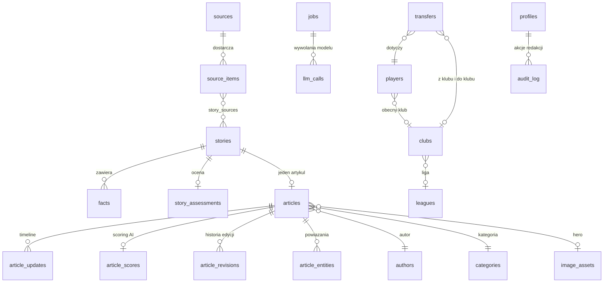

# Baza danych

PostgreSQL w Supabase jest jedynym źródłem prawdy: przechowuje źródła, pobrane materiały, wydarzenia, fakty, artykuły, encje sportowe oraz stan kolejki jobów. Wszystkie tabele mają włączone RLS.

Konwencje:

- nazwy tabel w `snake_case`, liczba mnoga; kolumny w `snake_case`,
- klucze główne `id uuid primary key default gen_random_uuid()`,
- czasy jako `timestamptz`, domyślnie `now()`,
- każda tabela edytowalna ma `created_at` i `updated_at` (trigger `set_updated_at`),
- typy wyliczeniowe jako `enum` w Postgresie, nie jako `text` z `CHECK`,
- migracje są niezmienialne po scaleniu; poprawka to nowa migracja.

---

## 1. Model koncepcyjny



Najważniejsza relacja w całym schemacie: **`stories` to wydarzenie, `articles` to jego opis**. Jedna historia ma dokładnie jeden artykuł (`articles.story_id UNIQUE`), który jest aktualizowany, a nie duplikowany.

---

## 2. Typy wyliczeniowe

```sql
create type source_type as enum (
  'official_club', 'official_league', 'official_federation',
  'journalist', 'major_outlet', 'local_outlet', 'aggregator', 'social'
);

create type source_kind as enum ('rss', 'json_api', 'html');

create type story_status as enum (
  'new', 'clustering', 'extracting', 'validating',
  'drafting', 'review', 'approved', 'published', 'rejected', 'blocked'
);

create type article_status as enum (
  'draft', 'review', 'approved', 'published', 'rejected', 'archived'
);

create type publishability as enum ('auto', 'review', 'reject');

create type job_type as enum (
  'FETCH_SOURCE', 'PROCESS_STORY', 'EXTRACT_FACTS', 'VALIDATE_FACTS',
  'GENERATE_ARTICLE', 'GENERATE_TITLE', 'GENERATE_SEO', 'CHECK_ARTICLE',
  'PUBLISH_ARTICLE', 'GENERATE_IMAGE', 'UPDATE_ARTICLE', 'GENERATE_EMBEDDING'
);

create type job_status as enum ('queued', 'running', 'done', 'failed', 'dead', 'cancelled');

create type user_role as enum ('admin', 'editor', 'viewer');

create type entity_type as enum ('player', 'club', 'league');

create type transfer_status as enum (
  'rumour', 'interest', 'negotiations', 'agreement', 'medical', 'official', 'failed'
);
```

`GENERATE_IMAGE`, `UPDATE_ARTICLE` i `GENERATE_EMBEDDING` są zdefiniowane od początku, ale w MVP nie mają handlerów - dzięki temu nie trzeba później zmieniać typu enum pod ruchem produkcyjnym.

---

## 3. Warstwa źródeł

### 3.1 `sources`

Konfiguracja źródła i jego wiarygodność.

| Kolumna                              | Typ          | Uwagi                                         |
| ------------------------------------ | ------------ | --------------------------------------------- |
| `id`                                 | uuid         | PK                                            |
| `name`                               | text         | np. `Fabrizio Romano`                         |
| `url`                                | text         | strona główna źródła                          |
| `rss_url`                            | text         | wymagane dla `kind = 'rss'`                   |
| `kind`                               | source_kind  | mechanizm pobierania                          |
| `type`                               | source_type  | charakter źródła, decyduje o pułapie zaufania |
| `trust_score`                        | numeric(3,2) | 0.00 - 1.00                                   |
| `language`                           | text         | `pl`, `en`                                    |
| `sport`                              | text         | `football` (przygotowane na inne dyscypliny)  |
| `country`                            | text         | `pl`, `international`                         |
| `fetch_interval_minutes`             | int          | domyślnie 15                                  |
| `etag`, `last_modified`              | text         | cache warunkowy HTTP                          |
| `last_checked_at`, `last_success_at` | timestamptz  |                                               |
| `consecutive_failures`               | int          | circuit breaker                               |
| `active`                             | boolean      | wyłączane automatycznie po 10 błędach         |

Ranking zaufania jest wymuszony w bazie, nie tylko w kodzie:

```sql
alter table sources add constraint sources_trust_matches_type check (
  case type
    when 'official_club'       then trust_score = 1.00
    when 'official_league'     then trust_score = 1.00
    when 'official_federation' then trust_score = 1.00
    when 'journalist'          then trust_score between 0.80 and 0.95
    when 'major_outlet'        then trust_score between 0.70 and 0.85
    when 'local_outlet'        then trust_score between 0.60 and 0.75
    when 'aggregator'          then trust_score <= 0.50
    when 'social'              then trust_score <= 0.40
  end
);
```

Indeksy: `(active, last_checked_at)` dla dispatchera, `unique (rss_url)`.

### 3.2 `source_items`

Każda pojedyncza informacja pobrana ze źródła. To materiał roboczy, nie treść publikowana.

| Kolumna            | Typ         | Uwagi                                                                   |
| ------------------ | ----------- | ----------------------------------------------------------------------- |
| `id`               | uuid        | PK                                                                      |
| `source_id`        | uuid        | FK -> `sources`, `on delete cascade`                                    |
| `external_id`      | text        | `guid` z RSS                                                            |
| `url`              | text        |                                                                         |
| `title`            | text        |                                                                         |
| `title_normalized` | text        | lowercase, bez znaków diakrytycznych i interpunkcji - baza do `pg_trgm` |
| `content`          | text        | treść z feedu                                                           |
| `author`           | text        |                                                                         |
| `published_at`     | timestamptz |                                                                         |
| `hash`             | text        | `sha256(url                                                             |     | title_normalized)`, `UNIQUE` |
| `raw_data`         | jsonb       | pełna odpowiedź, retencja 30 dni                                        |
| `processed_at`     | timestamptz | null = nieprzetworzone                                                  |

Indeksy: `unique (hash)`, `unique (source_id, external_id)`, `gin (title_normalized gin_trgm_ops)`, `(published_at desc)`, `(processed_at) where processed_at is null`.

---

## 4. Warstwa wydarzeń i faktów

### 4.1 `stories`

Wydarzenie, jeszcze nie artykuł.

| Kolumna                            | Typ          | Uwagi                                                     |
| ---------------------------------- | ------------ | --------------------------------------------------------- |
| `id`                               | uuid         | PK                                                        |
| `title`                            | text         | tytuł roboczy, nie publikacyjny                           |
| `summary`                          | text         | jedno zdanie dla panelu                                   |
| `sport`                            | text         |                                                           |
| `category_id`                      | uuid         | FK -> `categories`                                        |
| `status`                           | story_status | domyślnie `new`                                           |
| `importance`                       | int          | 0 - 100, z `trust_score` źródeł i typu wydarzenia         |
| `event_type`                       | text         | `transfer`, `injury`, `match_result`, `contract`, `other` |
| `first_seen_at`, `last_updated_at` | timestamptz  |                                                           |
| `embedding`                        | vector(1536) | null w MVP, wypełniane w V2                               |

Indeksy: `(status, importance desc)`, `(last_updated_at desc)`, w V2 `ivfflat (embedding vector_cosine_ops)`.

### 4.2 `story_sources`

Jedna historia ma wiele źródeł - stąd bierze się wartość dodana portalu.

| Kolumna          | Typ                                                       |
| ---------------- | --------------------------------------------------------- |
| `story_id`       | uuid FK -> `stories`                                      |
| `source_item_id` | uuid FK -> `source_items`                                 |
| `match_method`   | text (`hash`, `trigram`, `entity`, `embedding`, `manual`) |
| `similarity`     | numeric(4,3)                                              |
| PK               | `(story_id, source_item_id)`                              |

### 4.3 `facts`

Strukturalne fakty w formacie subject-predicate-object. To one, a nie tekst źródła, są wejściem do generowania artykułu.

| Kolumna          | Typ          | Uwagi                                                 |
| ---------------- | ------------ | ----------------------------------------------------- |
| `id`             | uuid         | PK                                                    |
| `story_id`       | uuid         | FK -> `stories`                                       |
| `subject`        | text         | `Jan Kowalski`                                        |
| `predicate`      | text         | `plays_for`, `interested_in`, `opened_talks_with`     |
| `object`         | text         | `Lech Poznan`                                         |
| `value`          | jsonb        | dane liczbowe i daty: kwota, waluta, `contract_until` |
| `statement_pl`   | text         | fakt zapisany zdaniem, używany w prompcie pisania     |
| `confidence`     | numeric(3,2) | `check between 0 and 1`                               |
| `source_id`      | uuid         | FK -> `sources`, skąd pochodzi fakt                   |
| `source_item_id` | uuid         | FK -> `source_items`                                  |
| `verified`       | boolean      | ustawiane przez etap walidacji                        |
| `superseded_by`  | uuid         | FK -> `facts`, gdy nowy fakt zastępuje stary          |

Indeksy: `(story_id, predicate)`, `unique (story_id, subject, predicate, object, source_id)` - blokuje wielokrotne zapisanie tego samego faktu z tego samego źródła.

### 4.4 `story_assessments`

Wynik etapu oceny informacji (prompt nr 2). Jedna aktualna ocena na historię.

| Kolumna                        | Typ            | Uwagi                                  |
| ------------------------------ | -------------- | -------------------------------------- |
| `story_id`                     | uuid           | PK, FK -> `stories`                    |
| `publishability`               | publishability | `auto` / `review` / `reject`           |
| `confidence`                   | numeric(3,2)   |                                        |
| `conflicts`                    | jsonb          | lista sprzeczności między źródłami     |
| `approved_fact_ids`            | uuid[]         | tylko te fakty trafiają do generowania |
| `reasoning`                    | text           | uzasadnienie dla redaktora             |
| `model_used`, `prompt_version` | text           | audyt                                  |

---

## 5. Warstwa treści

### 5.1 `articles`

| Kolumna                                    | Typ            | Uwagi                                                         |
| ------------------------------------------ | -------------- | ------------------------------------------------------------- |
| `id`                                       | uuid           | PK                                                            |
| `story_id`                                 | uuid           | FK -> `stories`, **`UNIQUE`** - jedna historia, jeden artykuł |
| `title`                                    | text           | `check (char_length(title) <= 90)`                            |
| `slug`                                     | text           | `UNIQUE`, stabilny po publikacji                              |
| `lead`                                     | text           |                                                               |
| `content`                                  | jsonb          | bloki, patrz 5.2                                              |
| `excerpt`                                  | text           |                                                               |
| `seo_title`                                | text           | `check (char_length(seo_title) <= 70)`                        |
| `seo_description`                          | text           | `check (char_length(seo_description) between 120 and 165)`    |
| `canonical_url`                            | text           |                                                               |
| `status`                                   | article_status | domyślnie `draft`                                             |
| `author_id`                                | uuid           | FK -> `authors`                                               |
| `category_id`                              | uuid           | FK -> `categories`                                            |
| `hero_image_id`                            | uuid           | FK -> `image_assets`                                          |
| `ai_generated`                             | boolean        | domyślnie `true`, pokazywane w stopce artykułu                |
| `model_used`, `prompt_version`             | text           | audyt                                                         |
| `approved_by`                              | uuid           | FK -> `profiles`, wymagane do publikacji                      |
| `published_at`, `updated_at`, `created_at` | timestamptz    |                                                               |

Indeksy: `unique (slug)`, `unique (story_id)`, `(status, published_at desc)`, `(category_id, published_at desc)`, `(published_at desc) where status = 'published'`.

Trigger bezpieczeństwa - to jest techniczne wymuszenie zasady "człowiek w pętli":

```sql
create or replace function enforce_publish_guard() returns trigger as $$
begin
  if new.status = 'published' then
    if new.approved_by is null then
      raise exception 'Artykul nie moze zostac opublikowany bez akceptacji redaktora';
    end if;
    if exists (
      select 1 from article_scores s
      where s.article_id = new.id and s.unsupported_claims > 0
    ) then
      raise exception 'Artykul zawiera twierdzenia bez podparcia w faktach';
    end if;
    new.published_at := coalesce(new.published_at, now());
  end if;
  return new;
end;
$$ language plpgsql;
```

### 5.2 Format `content`

Treść jako bloki JSON, nie HTML - pełna kontrola nad renderowaniem, łatwa walidacja i bezpieczne osadzanie danych.

```json
{
  "version": 1,
  "blocks": [
    { "type": "paragraph", "text": "..." },
    { "type": "quote", "text": "...", "attribution": "Fabrizio Romano" },
    { "type": "image", "imageId": "uuid", "caption": "..." },
    { "type": "list", "style": "bullet", "items": ["...", "..."] },
    { "type": "fact_box", "factIds": ["uuid"], "title": "Co wiemy" },
    { "type": "heading", "level": 2, "text": "..." }
  ]
}
```

Każdy blok jest walidowany schematem zod przed zapisem; renderer w `components/article/BlockRenderer.tsx` obsługuje zamknięty zbiór typów i ignoruje nieznane.

### 5.3 `article_updates`

Realizuje zasadę "aktualizuj, nie produkuj kolejnego newsa".

| Kolumna        | Typ         | Uwagi                         |
| -------------- | ----------- | ----------------------------- |
| `id`           | uuid        | PK                            |
| `article_id`   | uuid        | FK -> `articles`              |
| `body`         | text        | treść aktualizacji            |
| `fact_ids`     | uuid[]      | fakty, które ją wywołały      |
| `published_at` | timestamptz | godzina pokazywana na stronie |
| `approved_by`  | uuid        | FK -> `profiles`              |

### 5.4 `article_scores`

| Kolumna                                                          | Typ                              |
| ---------------------------------------------------------------- | -------------------------------- |
| `article_id`                                                     | uuid PK FK -> `articles`         |
| `factual_accuracy`, `originality`, `seo`, `clickbait`, `quality` | numeric(3,2)                     |
| `unsupported_claims`                                             | int                              |
| `issues`                                                         | jsonb (lista uwag dla redaktora) |
| `model_used`, `prompt_version`                                   | text                             |
| `checked_at`                                                     | timestamptz                      |

### 5.5 `article_revisions`

Snapshot treści przed każdą zmianą - podstawa do policzenia, jak często redaktor musi poprawiać model.

| Kolumna         | Typ                               |
| --------------- | --------------------------------- |
| `id`            | uuid PK                           |
| `article_id`    | uuid FK                           |
| `title`, `lead` | text                              |
| `content`       | jsonb                             |
| `edited_by`     | uuid FK -> `profiles` (null = AI) |
| `created_at`    | timestamptz                       |

### 5.6 `article_entities`

Automatyczne linkowanie wewnętrzne.

| Kolumna       | Typ                                    |
| ------------- | -------------------------------------- |
| `article_id`  | uuid FK                                |
| `entity_type` | entity_type                            |
| `entity_id`   | uuid                                   |
| `role`        | text (`main`, `mentioned`)             |
| PK            | `(article_id, entity_type, entity_id)` |

### 5.7 `article_redirects`

| Kolumna      | Typ         |
| ------------ | ----------- |
| `old_slug`   | text PK     |
| `article_id` | uuid FK     |
| `created_at` | timestamptz |

### 5.8 `authors`, `categories`

`authors`: `id`, `name`, `slug`, `bio`, `avatar_url`, `role_title`, `profile_id` (FK -> `profiles`), `x_url`. Autorem publikowanego artykułu jest zawsze realna osoba z redakcji - to świadoma decyzja pod E-E-A-T i pod uczciwość wobec czytelnika.

`categories`: `id`, `name`, `slug` (`transfery`, `pilka-nozna`, `ekstraklasa`), `description`, `seo_title`, `seo_description`, `parent_id`.

---

## 6. Encje sportowe

Pozwalają zbudować z portalu bazę wiedzy, nie tylko strumień tekstów.

### 6.1 `players`

`id`, `name`, `slug` (`UNIQUE`), `full_name`, `aliases text[]` (do rozpoznawania w tekstach), `country`, `birth_date`, `position`, `current_club_id` (FK -> `clubs`), `image_id` (FK -> `image_assets`), `external_ids jsonb`.

Indeksy: `unique (slug)`, `gin (aliases)`, `gin (name gin_trgm_ops)`.

### 6.2 `clubs`

`id`, `name`, `slug`, `short_name`, `aliases text[]` (np. `Red Devils`, `United`), `country`, `league_id` (FK -> `leagues`), `logo_id`, `founded_year`.

### 6.3 `leagues`

`id`, `name`, `slug`, `country`, `tier`, `logo_id`.

### 6.4 `transfers`

Docelowo baza transferowa, w MVP tylko zapisywana, bez osobnego UI.

`id`, `player_id`, `from_club_id`, `to_club_id`, `status` (transfer_status), `fee numeric`, `currency`, `season`, `contract_until date`, `story_id`, `confirmed_at`, `confirmed_by_source_id`.

Indeksy: `(player_id, created_at desc)`, `(status)`, `unique (player_id, to_club_id, season) where status = 'official'`.

---

## 7. Media

### 7.1 `image_assets`

Bez uporządkowanych praw do zdjęć nie da się prowadzić prawdziwego portalu, dlatego licencja jest wymagana od pierwszego dnia.

| Kolumna                     | Typ        | Uwagi                                              |
| --------------------------- | ---------- | -------------------------------------------------- |
| `id`                        | uuid       | PK                                                 |
| `kind`                      | image_kind | `hero`, `logo` lub `portrait`                      |
| `storage_path`              | text       | ścieżka w Supabase Storage                         |
| `url`                       | text       | publiczny URL lub CDN                              |
| `source`                    | text       | skąd pochodzi                                      |
| `license`                   | text       | `check (license is not null)`                      |
| `photographer`, `copyright` | text       |                                                    |
| `width`, `height`           | int        | `check (kind <> 'hero' or width >= 1200)`          |
| `alt`                       | text       | `check (length(btrim(alt)) > 0)`                   |
| `is_ai_generated`           | boolean    | domyślnie `false`; zdjęć zawodników nie generujemy |

Wymóg 1200 px dotyczy obrazu głównego artykułu, bo to on trafia do Discover. Loga klubów i portrety są z natury mniejsze, dlatego ograniczenie jest warunkowe - inaczej nie dałoby się zapisać herbu klubu.

---

## 8. Kolejka i audyt

### 8.1 `jobs`

| Kolumna                               | Typ               | Uwagi                            |
| ------------------------------------- | ----------------- | -------------------------------- |
| `id`                                  | uuid              | PK                               |
| `type`                                | job_type          |                                  |
| `payload`                             | jsonb             | walidowany schematem zod per typ |
| `status`                              | job_status        | domyślnie `queued`               |
| `priority`                            | int               | 0 - 100, wyżej = pilniej         |
| `attempts`                            | int               |                                  |
| `max_attempts`                        | int               | domyślnie 3                      |
| `next_run_at`                         | timestamptz       | backoff                          |
| `locked_at`, `locked_by`              | timestamptz, text | detekcja osieroconych jobów      |
| `dedupe_key`                          | text              | idempotencja                     |
| `error`                               | text              |                                  |
| `story_id`, `article_id`, `source_id` | uuid              | korelacja, nullable              |
| `created_at`, `processed_at`          | timestamptz       |                                  |

Indeksy:

```sql
create index jobs_claim_idx on jobs (status, priority desc, next_run_at)
  where status in ('queued', 'failed');
create unique index jobs_dedupe_idx on jobs (dedupe_key)
  where status in ('queued', 'running', 'failed');
create index jobs_dead_idx on jobs (created_at desc) where status = 'dead';
```

### 8.2 Funkcje kolejki

```sql
-- atomowe pobranie partii zadan przez wiele rownoleglych workerow
create or replace function claim_jobs(p_types job_type[], p_limit int default 5, p_worker text default null)
returns setof jobs as $$
  update jobs j
     set status = 'running', locked_at = now(), locked_by = p_worker, attempts = attempts + 1
   where j.id in (
     select id from jobs
      where status in ('queued', 'failed')
        and next_run_at <= now()
        and (p_types is null or type = any(p_types))
      order by priority desc, next_run_at
      limit p_limit
      for update skip locked
   )
  returning j.*;
$$ language sql;
```

Pozostałe: `enqueue_job(p_type, p_payload, p_priority, p_dedupe_key)`, `complete_job(p_id)`, `fail_job(p_id, p_error)` z backoffem `30s * 2^attempts` i przejściem do `dead` po `max_attempts`, `requeue_stale_jobs()` dla jobów w `running` dłużej niż 15 minut.

### 8.3 `llm_calls`

`id`, `job_id`, `story_id`, `stage` (`extract`, `validate`, `write`, `title`, `seo`, `qa`), `model`, `prompt_version`, `tokens_in`, `tokens_out`, `cost_usd numeric(10,6)`, `latency_ms`, `ok boolean`, `error`, `created_at`.

Pozwala odpowiedzieć na pytanie "ile kosztował ten artykuł" i "który etap przepala budżet".

### 8.4 `audit_log`

`id`, `actor_id` (FK -> `profiles`), `action` (`approve`, `reject`, `edit`, `publish`, `unpublish`, `source_change`), `entity_type`, `entity_id`, `diff jsonb`, `created_at`.

### 8.5 `settings`

Konfiguracja runtime bez deployu: `key text PK`, `value jsonb`, `description`, `updated_at`, `updated_by`.

Klucze startowe: `pipeline_enabled`, `auto_publish_enabled` (w MVP `false`), `quality_threshold` (0.90), `clickbait_threshold` (0.10), `max_articles_per_hour`, `model_default`, `model_escalation`, `daily_llm_budget_usd`.

---

## 9. Użytkownicy i RLS

`profiles`: `id` (FK -> `auth.users`), `email`, `display_name`, `role` (user_role), `active`.

Polityki - zasada domyślna to "brak dostępu", uprawnienia dodawane wybiórczo:

| Tabela                                                                 | anon                                                               | authenticated (editor / admin)            | service_role |
| ---------------------------------------------------------------------- | ------------------------------------------------------------------ | ----------------------------------------- | ------------ |
| `articles`                                                             | `select` gdy `status = 'published'`                                | pełny `select`, `update` treści i statusu | pełny        |
| `article_updates`                                                      | `select` gdy artykuł opublikowany                                  | `select`, `insert`                        | pełny        |
| `authors`, `categories`, `players`, `clubs`, `leagues`, `image_assets` | `select`                                                           | `select`, `update` (admin)                | pełny        |
| `article_entities`, `article_redirects`                                | `select` (potrzebne do linkowania wewnętrznego i przekierowań 301) | pełny                                     | pełny        |
| `article_scores`, `article_revisions`                                  | brak                                                               | `select`                                  | pełny        |
| `stories`, `facts`, `story_assessments`, `story_sources`               | brak                                                               | `select`                                  | pełny        |
| `sources`, `source_items`                                              | brak                                                               | `select`; `update` tylko admin            | pełny        |
| `jobs`, `llm_calls`, `settings`                                        | brak                                                               | `select` (admin)                          | pełny        |
| `audit_log`                                                            | brak                                                               | `select` (admin), `insert` przez trigger  | pełny        |
| `transfers`                                                            | `select` gdy `status = 'official'`                                 | `select`                                  | pełny        |

Zapisy pipeline'u wykonuje wyłącznie `service_role` z Edge Functions. Panel redaktora działa na sesji użytkownika i może zmienić tylko to, co jest mu potrzebne do recenzji.

---

## 10. Kolejność migracji

| Plik                        | Zawartość                                                                                                                         |
| --------------------------- | --------------------------------------------------------------------------------------------------------------------------------- |
| `0001_extensions.sql`       | `pg_trgm`, `unaccent`, `vector`, warunkowo `pg_cron` (`pgcrypto` i `pg_net` instaluje sam Supabase)                               |
| `0002_enums.sql`            | wszystkie typy wyliczeniowe                                                                                                       |
| `0003_profiles_helpers.sql` | `profiles`, funkcje `is_editor()`, `is_admin()`, `normalize_title()`, trigger `set_updated_at`                                    |
| `0004_sources.sql`          | `sources` z ograniczeniem zaufania                                                                                                |
| `0005_source_items.sql`     | `source_items`, indeksy trigram                                                                                                   |
| `0006_taxonomy.sql`         | `authors`, `categories`                                                                                                           |
| `0007_stories.sql`          | `stories`, `story_sources`                                                                                                        |
| `0008_facts.sql`            | `facts`, `story_assessments`                                                                                                      |
| `0009_media.sql`            | `image_assets`, bucket w Storage                                                                                                  |
| `0010_entities.sql`         | `leagues`, `clubs`, `players`, `transfers`                                                                                        |
| `0011_articles.sql`         | `articles`, `article_updates`, `article_scores`, `article_revisions`, `article_entities`, `article_redirects`, trigger publikacji |
| `0012_jobs.sql`             | `jobs`, funkcje kolejki, `llm_calls`                                                                                              |
| `0013_settings_audit.sql`   | `settings` z wartościami domyślnymi, `audit_log`, trigger śladu zmian statusu artykułu                                            |
| `0014_rls_policies.sql`     | polityki dla wszystkich tabel oraz bucketu Storage                                                                                |
| `0015_cron.sql`             | harmonogramy `pg_cron` wywołujące Edge Functions przez `pg_net`                                                                   |

Kolejność wynika z kluczy obcych: taksonomia (`0006`) musi istnieć przed `stories`, media (`0009`) przed encjami i artykułami, a encje (`0010`) przed `transfers`, które wskazują na `stories`.

Dwie rzeczy, o które łatwo się potknąć przy zmianach w `0015`:

- Tabela `cron.job` należy do roli `supabase_admin`, a migracje wykonuje `postgres`. `update cron.job` kończy się błędem `permission denied for table job` - do włączania i wyłączania harmonogramów służy `cron.alter_job`.
- Harmonogramy zakładamy nieaktywne. Włączenie ich to świadoma decyzja dla stagingu i produkcji, po ustawieniu sekretów w Vault.

`seed.sql`: 11 źródeł startowych (oficjalne kanały klubów i lig, jeden uznany dziennikarz, duże serwisy, jeden agregator), kategorie `transfery`, `pilka-nozna` i `ekstraklasa`, ligi, kluby z aliasami i zawodnicy dla testów rozpoznawania encji, konto redakcyjne dla środowiska lokalnego (`redaktor@local.test`).

Źródła, których adresu feedu nie potwierdziliśmy, są w seedzie oznaczone jako nieaktywne. Martwy feed to fałszywe alarmy w circuit breakerze, więc adresów nie zgadujemy - weryfikujemy je przed włączeniem.

---

## 11. Retencja i utrzymanie

- `source_items.raw_data` czyszczone po 30 dniach, sam wiersz zostaje (potrzebny do deduplikacji).
- `jobs` ze statusem `done` usuwane po 14 dniach; `dead` zostają do ręcznej analizy.
- `llm_calls` agregowane miesięcznie, szczegóły trzymane 90 dni.
- `article_revisions` bez limitu - to materiał do oceny jakości modelu.
- Cotygodniowy `vacuum analyze` na `source_items` i `jobs` (`pg_cron`).
- Partycjonowanie miesięczne `source_items` planowane, gdy tabela przekroczy kilka milionów wierszy.
