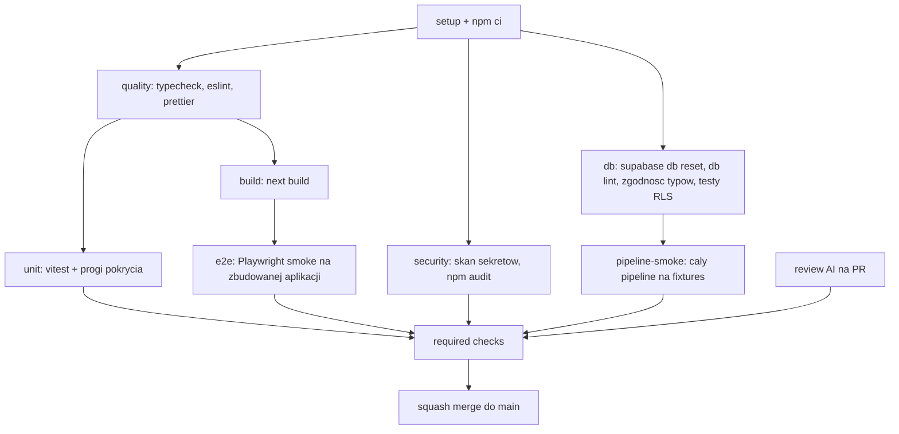

# Standardy inżynierskie i bramki jakości

Dokument opisuje, na jakich warunkach kod wchodzi do tego repozytorium. Dotyczy w równym stopniu ludzi i agentów AI, ale dla agentów jest wiążący dosłownie: **agent nie może uznać zadania za wykonane, jeśli którakolwiek bramka jest czerwona.**

Model pracy: podwójna bramka. Lokalnie blokują git hooki, zdalnie blokuje CI plus wymagany review na pull requeście. Bezpośredni push na `main` jest niemożliwy.

Dokumenty powiązane: [AGENTS.md](../AGENTS.md), [docs/architecture.md](architecture.md), [docs/database.md](database.md), [docs/ai-pipeline.md](ai-pipeline.md).

---

## 1. Ograniczenia dla agentów dostarczających kod

### 1.1 Twarde zakazy

1. **Zakaz `git commit --no-verify`, `--no-gpg-sign` w celu ominięcia hooka i zakazu `git push --force` na gałęzie współdzielone.** Jeśli hook blokuje commit, naprawiasz przyczynę, nie hook.
2. **Zakaz commitowania przy czerwonym `typecheck`, `lint` lub `test`.** Nie ma commitów "naprawię w następnym".
3. **Zakaz pushowania na `main`.** Praca zawsze na gałęzi `feat/*`, `fix/*`, `chore/*`, `docs/*`, scalana pull requestem.
4. **Zakaz wyłączania reguł zamiast naprawy.** `@ts-ignore` jest zabroniony; `@ts-expect-error` tylko z komentarzem wyjaśniającym i tylko punktowo. `eslint-disable` dla całego pliku jest zabroniony.
5. **Zakaz `any`, `as unknown as`, niepotrzebnych rzutowań.** Typ pochodzi z `database.types.ts` albo ze schematu zod.
6. **Zakaz commitowania sekretów i plików `.env*`** (poza `.env.example` z placeholderami).
7. **Zakaz wyłączania i pomijania testów.** `it.skip` i `describe.skip` wymagają komentarza z powodem i odnośnika do zadania; CI liczy pominięte testy i zgłasza je w podsumowaniu.
8. **Zakaz edycji migracji scalonej do `main`.** Poprawka to nowa migracja. CI to sprawdza.
9. **Zakaz commitowania niezsynchronizowanych plików generowanych.** `database.types.ts` musi odpowiadać migracjom - CI regeneruje typy i porównuje.
10. **Zakaz zmiany zasad z sekcji "Zasady, których nie wolno naruszyć" w [AGENTS.md](../AGENTS.md)** bez osobnego PR zmieniającego dokumentację i wyraźnej zgody właściciela projektu.

### 1.2 Rozmiar i kształt zmiany

- Jeden commit to jedna logiczna zmiana. Jeden PR to jeden temat.
- Miękki limit: 400 zmienionych linii w PR bez plików generowanych. Powyżej tego agent dzieli pracę i wyjaśnia podział w opisie PR.
- Migracje schematu idą w osobnym PR niż zmiany UI. Zmiany promptów idą w osobnym PR niż zmiany handlerów.
- Zmiana dotykająca RLS, promptów albo schematu bazy musi być oznaczona w opisie PR - to trzy obszary o najwyższym ryzyku.
- Refaktor nie jest łączony ze zmianą zachowania w jednym commicie.

### 1.3 Definicja ukończenia zadania

Zadanie jest zrobione, gdy wszystkie punkty są spełnione. Nie "w większości".

- `npm run typecheck` zielony (`tsc --noEmit`, tryb `strict`).
- `npm run lint` zielony, bez nowych ostrzeżeń (`--max-warnings=0`).
- `npm test` zielony, nowa logika ma testy.
- `supabase db reset` przechodzi, jeśli zmiana dotyka SQL lub seedu.
- `npm run build` przechodzi, jeśli zmiana dotyka `app/` lub `components/`.
- Dokumentacja zaktualizowana, jeśli zmienił się schemat, kontrakt LLM albo zasada działania.
- Wykonany przegląd kodu (sekcja 2) bez nierozwiązanych uwag o wadze `high`.
- W podsumowaniu dla użytkownika napisane wprost, co zostało sprawdzone i czym, a co nie zostało sprawdzone.

### 1.4 Uczciwość raportowania

Agent nie pisze "działa", jeśli tego nie uruchomił. Dopuszczalne sformułowania to "uruchomiłem X, wynik Y" albo "nie uruchomiłem X, bo Z". Jeśli bramka nie mogła zostać uruchomiona (na przykład Docker nie działa), agent mówi to jawnie i nie commituje zmian dotykających SQL.

---

## 2. Code review przed każdym commitem

Każdy commit przechodzi przegląd. Lokalnie wykonuje go agent, zdalnie automatyczny reviewer na pull requeście. Jedno nie zastępuje drugiego: lokalny przegląd łapie błędy zanim powstaną w historii, zdalny jest niezależną kontrolą całości gałęzi.

### 2.1 Przegląd lokalny (przed `git commit`)

Kolejność, bez skrótów:

1. Przeczytaj cały `git diff --staged` linia po linii. Nie commituj kodu, którego nie przeczytałeś po napisaniu.
2. Uruchom automatycznego recenzenta na zmianach (`Bugbot` na niescommitowanych zmianach). Uwagi o wadze `high` blokują commit, `medium` wymagają decyzji opisanej w commicie, `low` mogą zostać.
3. Przejdź checklistę z sekcji 2.2.
4. Dopiero wtedy commituj - hook uruchomi bramki techniczne.

### 2.2 Checklista przeglądu

Poprawność:

- Czy każde wyjście LLM jest walidowane schematem zod przed zapisem?
- Czy handler joba jest idempotentny (`upsert` po `story_id` lub `article_id`)?
- Czy błędy są propagowane do `fail_job`, a nie łykane?
- Czy zapytania mają jawne kolumny, bez `select *`?
- Czy nowe tabele mają włączone RLS i polityki?

Bezpieczeństwo:

- Czy `service_role` i `OPENAI_API_KEY` nie wyciekły do kodu klienckiego ani do `NEXT_PUBLIC_*`?
- Czy nowy route handler weryfikuje uprawnienia albo sekret webhooka?
- Czy dane wejściowe z zewnątrz są walidowane?

Higiena:

- Czy w diffie nie ma `console.log`, zakomentowanego kodu, plików tymczasowych, fragmentów wygenerowanych "na próbę"?
- Czy komentarze wyjaśniają ograniczenie, a nie opisują następnej linii?
- Czy nazwy są zgodne z konwencją i czy teksty dla użytkownika są po polsku?

Zgodność z architekturą:

- Czy kod jest w warstwie, w której powinien być (LLM tylko w Edge Functions, dostęp do kolejki tylko przez `jobs.ts`)?
- Czy zmiana nie omija triggera publikacji ani kolejności `fakty -> walidacja -> tekst`?
- Czy zmiana promptu podnosi `prompt_version`?

### 2.3 Przegląd na pull requeście

- Automatyczny reviewer AI uruchamiany na każdym PR, jako **wymagany check**. Uwagi `high` blokują scalenie.
- Wymagana minimum jedna akceptacja przed scaleniem (właściciel projektu lub reviewer AI z zieloną oceną, zgodnie z ustawieniem branch protection).
- Scalanie wyłącznie przez squash, z komunikatem w formacie konwencjonalnym.
- `main` zablokowany: brak bezpośrednich pushy, brak force push, wymagane aktualne gałęzie przed scaleniem.

---

## 3. Hooki lokalne

Menedżer: `husky`, filtrowanie plików przez `lint-staged`, walidacja komunikatu przez `commitlint`.

### 3.1 `pre-commit` - pełna bramka

Wybraliśmy wariant maksymalnie twardy: przed każdym commitem uruchamiany jest cały zestaw, nie tylko pliki w commicie.

```
1. lint-staged            -> eslint --fix + prettier na plikach w commicie
2. npm run typecheck      -> tsc --noEmit na calym repo
3. npm run lint           -> eslint na calym repo, --max-warnings=0
4. npm test               -> vitest run
5. npm run verify:db      -> tylko gdy w commicie sa zmiany w supabase/**:
                             supabase db reset + supabase db lint
                             + regeneracja typow i porownanie z database.types.ts
```

Jedno odstępstwo od "zawsze wszystko", świadome i warte odnotowania: `verify:db` uruchamia się warunkowo, gdy commit dotyka `supabase/**`. Powód jest praktyczny - `supabase db reset` wymaga działającego Dockera i trwa minuty, więc wymuszanie go przy commicie zmieniającym komponent Reacta prowadzi wprost do tego, że ludzie zaczynają używać `--no-verify`, a wtedy cała bramka przestaje istnieć. Bezwarunkowo uruchamia to `pre-push` i CI, więc nic nie przechodzi bez sprawdzenia. Jeśli chcesz wariant bez wyjątku, ustawienie `STRICT_PRECOMMIT=1` wymusza `verify:db` przy każdym commicie.

### 3.2 `commit-msg`

`commitlint` z konwencją `typ(zakres): opis`. Dozwolone typy: `feat`, `fix`, `refactor`, `perf`, `test`, `docs`, `chore`, `ci`, `db`, `prompt`. Zakresy zgodne z modułami z [architektury](architecture.md): `ingestion`, `dedup`, `extraction`, `validation`, `generation`, `qa`, `editorial`, `delivery`, `platform`, `db`, `seo`, `admin`.

### 3.3 `pre-push`

```
1. npm run verify         -> typecheck + lint + test + build
2. npm run deno:check && npm run deno:lint -> kod Edge Functions w runtime Deno
3. npm run verify:db      -> bezwarunkowo: db reset + db lint + zgodnosc typow
4. npm run test:pipeline  -> smoke pipeline'u na fixtures (LLM_ENABLED=false)
5. skan sekretow na zakresie pushowanych commitow
```

### 3.4 Skrypty w `package.json`

| Skrypt          | Zawartość                                                                             |
| --------------- | ------------------------------------------------------------------------------------- |
| `typecheck`     | `tsc --noEmit`                                                                        |
| `lint`          | `eslint . --max-warnings=0`                                                           |
| `format:check`  | `prettier --check .`                                                                  |
| `test`          | `vitest run`                                                                          |
| `test:db`       | `supabase test db` - testy pgTAP: RLS, trigger publikacji, kolejka                    |
| `test:pipeline` | smoke całego pipeline'u na fixtures; wchodzi razem z pierwszymi handlerami (etap 1)   |
| `deno:check`    | `deno check --frozen` entrypointów i `_shared/` - typy tak, jak widzi je Edge Runtime |
| `deno:lint`     | `deno lint` w `supabase/functions/`                                                   |
| `env:local`     | generuje `.env.local` z danych działającego lokalnego stacku                          |
| `verify`        | `typecheck && lint && format:check && test && build`                                  |
| `verify:db`     | `supabase db reset && db lint && test db && gen types && git diff --exit-code`        |
| `verify:all`    | `verify && deno:check && deno:lint && verify:db && test:pipeline` - to samo, co CI    |

Zasada: **to, co robi CI, musi dać się uruchomić jedną komendą lokalnie** (`npm run verify:all`). Bez tego agent nie ma jak sprawdzić pracy przed pushem.

---

## 4. Pipeline CI

GitHub Actions, wyzwalane na `pull_request` do `main` oraz na `push` do `main`. Node przypięty przez `.nvmrc`, zależności przez `npm ci`, cache npm włączony, `concurrency` z `cancel-in-progress`.



### 4.1 Jakość statyczna - job `quality`

- `tsc --noEmit` w trybie `strict`.
- `eslint . --max-warnings=0`.
- `prettier --check .`.
- Guard na niezmienialność migracji: skrypt porównuje pliki w `supabase/migrations/` z wersją z `main` i przerywa, jeśli istniejący plik został zmieniony lub usunięty.
- Guard na `prompt_version`: jeśli zmienił się plik w `_shared/prompts/`, musi zmienić się też odpowiadający mu wpis wersji.
- Guard na zakazane wzorce: `@ts-ignore`, `eslint-disable` na poziomie pliku, `any` w nowym kodzie, `console.log` w `supabase/functions/` i `app/`.

### 4.2 Testy jednostkowe - job `unit`

- `vitest run --coverage`.
- Progi pokrycia egzekwowane dla kodu o wysokim ryzyku: `supabase/functions/_shared/lib/**` i `_shared/contracts/**` minimum 80 procent linii; reszta repozytorium bez progu, żeby nie generować testów-atrap.
- Obowiązkowo pokryte: parsowanie RSS na zapisanych plikach, normalizacja tytułu i hash, deduplikacja, progi `trust_score`, backoff w `fail_job`, walidacja bloków artykułu, lista zakazanych fraz w tytule.
- Testy nie wołają zewnętrznego API. Brak klucza OpenAI w CI jest celowy.

### 4.3 Baza danych - job `db`

- `supabase/setup-cli`, `supabase start`, `supabase db reset` na migracjach i seedzie.
- `supabase db lint` - błędy blokują.
- Regeneracja `database.types.ts` i `git diff --exit-code` - niezsynchronizowane typy blokują.
- Testy RLS w SQL: dla każdej tabeli publicznej sprawdzenie, że rola `anon` widzi tylko to, co powinna (w szczególności: brak dostępu do `sources`, `source_items`, `stories`, `facts`, `jobs`, `llm_calls` oraz do artykułów innych niż `published`).
- Test triggera publikacji: próba ustawienia `status = 'published'` bez `approved_by` musi zakończyć się wyjątkiem.

### 4.4 Weryfikacja działania - job `pipeline-smoke`

To jest część "czy to w ogóle działa", nie tylko "czy się kompiluje". Przebieg na lokalnej bazie w CI, z `LLM_ENABLED=false`:

1. Wstaw fixture'y RSS jako odpowiedzi źródeł.
2. Uruchom `FETCH_SOURCE` - sprawdź, że powstały `source_items` z unikalnymi hashami.
3. Uruchom `PROCESS_STORY` na pięciu materiałach o tym samym wydarzeniu - sprawdź, że powstała **jedna** historia z pięcioma źródłami.
4. Przepchnij kolejkę przez `EXTRACT_FACTS`, `VALIDATE_FACTS`, `GENERATE_ARTICLE`, `GENERATE_TITLE`, `GENERATE_SEO`, `CHECK_ARTICLE`.
5. Asercje końcowe: artykuł ma `status = 'review'`, `unsupported_claims = 0`, każdy fakt w treści jest w `used_fact_ids`, tytuł przechodzi walidację antyclickbaitową, `jobs` nie zawiera wpisów `dead`.
6. Test negatywny: historia z jednego źródła o niskim zaufaniu kończy się na `blocked`, bez artykułu.
7. Test odporności: job, który rzuca wyjątkiem, dostaje `attempts = 1` i `next_run_at` w przyszłości, a nie wywala workera.

### 4.5 Interfejs - job `e2e`

Playwright na zbudowanej aplikacji, mały zestaw smoke:

- strona główna renderuje listę artykułów,
- strona artykułu renderuje bloki, listę źródeł i informację o roli AI,
- `/admin` bez sesji przekierowuje do logowania,
- `/sitemap.xml` i `/sitemap-news.xml` zwracają 200 i poprawny XML,
- artykuł zawiera poprawny JSON-LD `NewsArticle` z `datePublished` i `dateModified`,
- brak błędów w konsoli przeglądarki.

### 4.6 Bezpieczeństwo - job `security`

- Skan sekretów na całej historii PR (blokujący).
- `npm audit --audit-level=high` (blokujący dla `high` i `critical`).
- Sprawdzenie, że w diffie nie pojawiło się `NEXT_PUBLIC_` przy nazwie zawierającej `SERVICE_ROLE`, `SECRET` albo `API_KEY`.

### 4.7 Wydajność - job `lighthouse`

Budżety z [architektury](architecture.md): LCP poniżej 2,0 s, CLS poniżej 0,1. Start jako ostrzeżenie, blokujący od etapu 4 roadmapy, gdy strona publiczna jest gotowa.

### 4.8 Checki wymagane na `main`

Docelowo: `quality`, `unit`, `db`, `pipeline-smoke`, `build`, `e2e`, `security` oraz akceptacja review. Branch protection: brak bezpośrednich pushy, brak force push, wymagana aktualna gałąź, wymagane rozwiązanie wszystkich wątków w review.

Jako wymagane ustawiamy tylko te checki, które faktycznie istnieją - wymóg nieistniejącego checka blokuje każdy merge na zawsze. Aktualny stan jest w tabeli poniżej.

### 4.9 Stan wdrożenia bramek

| Bramka                                            | Stan      | Uwagi                                                                                    |
| ------------------------------------------------- | --------- | ---------------------------------------------------------------------------------------- |
| `quality` (typy, eslint, prettier)                | działa    |                                                                                          |
| `unit` (vitest + progi pokrycia)                  | działa    | progi dla `_shared/lib/**` i `_shared/contracts/**`                                      |
| `db` (migracje, `db lint`, pgTAP, zgodność typów) | działa    | 25 testów pgTAP: RLS, trigger publikacji, kolejka                                        |
| `build` (`next build`)                            | działa    | bez dostępu do bazy i kluczy                                                             |
| `security` (`npm audit`, skan sekretów)           | działa    |                                                                                          |
| guard niezmienialności migracji                   | brak w CI | wymuszany przez hook `beforeShellExecution` i review; do CI wchodzi razem z pierwszym PR |
| guard `prompt_version`                            | brak w CI | hook `afterFileEdit` przypomina; egzekucja od etapu 2                                    |
| `pipeline-smoke`                                  | brak      | wchodzi z pierwszymi handlerami (etap 1)                                                 |
| `e2e`, `lighthouse`                               | brak      | wchodzą z etapem 4                                                                       |

Zakazane wzorce (`@ts-ignore`, `any`, `console.log`, `as unknown as`) są egzekwowane przez ESLint, więc blokuje je job `quality` i hook `pre-commit`, a nie osobny skrypt.

### 4.10 Zadania cykliczne

- Nocny przebieg `db` plus `pipeline-smoke` na `main` - wyłapuje zepsucie przez zmiany w zależnościach.
- Cotygodniowe aktualizacje zależności w osobnych PR, przechodzące tę samą bramkę.

---

## 5. Kolejność wdrożenia bramek

Bramki powstają razem z kodem, nie po nim. W etapie 0 roadmapy:

1. `package.json` ze skryptami, `.nvmrc`, ESLint, Prettier, `tsconfig` w trybie `strict`, vitest.
2. `husky`, `lint-staged`, `commitlint` plus hooki `pre-commit`, `commit-msg`, `pre-push`.
3. `ci.yml` z jobami `quality`, `unit`, `build`, `security` - działają od pierwszego commitu z kodem.
4. Job `db` po pierwszych migracjach.
5. Job `pipeline-smoke` po pierwszych handlerach (etap 1 roadmapy), rozbudowywany wraz z etapami AI.
6. Job `e2e` po pierwszych stronach publicznych (etap 4), `lighthouse` na końcu etapu 4.

Repozytorium zdalne i branch protection ustawiamy na początku etapu 0, żeby pierwszy kod od razu przechodził przez pull request.
